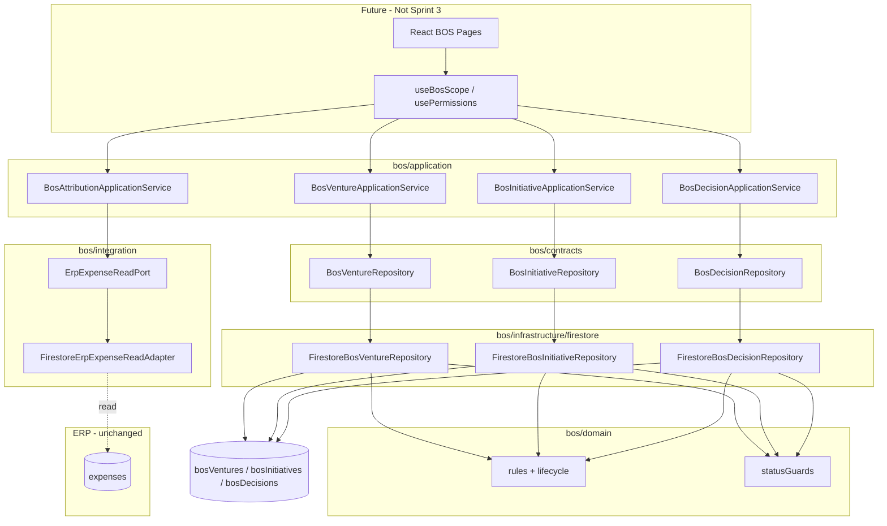

# BOS Integration Layer — Implementation Guide (Sprint 3)

Architecture frozen at v1.0. This document describes the **integration layer** added in Sprint 3: validated repositories, application services, ERP read bridge, and test harness. No UI is exposed.

---

## 1. Layer Model

```
Future React UI (Sprint 4+)
        │
        ▼
Application Services  ← bos/application/*
        │
        ├── Domain rules & lifecycle guards  ← bos/domain/*
        │
        ├── Repository contracts  ← bos/contracts/*
        │
        ├── Firestore repositories  ← bos/infrastructure/firestore/*
        │
        └── ERP read ports (bridge)  ← bos/integration/*
                │
                ▼
        ERP collections (READ ONLY)
        expenses | leads | invoices | …
```

**Sidecar law:** BOS writes only to `bos*` collections. ERP modules never import BOS.

---

## 2. Repository Flow

1. Application service receives `BosActorScope` (`companyId`, `actorUserId`).
2. Service calls repository contract method.
3. Repository validates input via **domain rules** (`validateCreate*`, `validateUpdate*`, lifecycle transitions).
4. Repository validates **status enums** via `domain/guards/statusGuards.ts` (runtime guard against invalid strings).
5. Repository validates **FK links** (initiative → venture, decision → venture/initiative).
6. Converter maps domain entity ↔ Firestore document (`models/*Document.ts`).
7. Firestore persist; converter maps result back to domain entity.
8. Cross-tenant reads throw `BosRepositoryError` via `assertCompanyMatch`.

**Physical delete:** forbidden on all BOS collections (rules + domain).

---

## 3. Application Service Flow

| Service | Responsibility |
|---------|----------------|
| `BosVentureApplicationService` | CRUD, status transitions, orchestrated archive (open initiatives check) |
| `BosInitiativeApplicationService` | CRUD, lifecycle transitions, close with lesson rule |
| `BosDecisionApplicationService` | CRUD, status transitions, evaluate |
| `BosAttributionApplicationService` | Phase 1B skeleton; feature-flag gated; read-only expense preview |

**Rules for future UI:**
- React components call **application services only** — never `FirestoreBos*Repository` directly.
- Always build scope from `resolveCompanyIdForUser(user, profile)` (R-014).
- Permission checks (`bos_*`) happen in UI/hooks before calling services (not yet wired).

Example (future hook):

```typescript
const scope = {
  companyId: resolveCompanyIdForUser(user, profile),
  actorUserId: user.uid,
};
await bosVentureApplicationService.createVenture(scope, { name, ownerUserId });
```

---

## 4. ERP Integration Flow (Bridge)

```
┌─────────────────┐     read port      ┌──────────────────────┐
│  ERP Expenses   │ ◄───────────────── │ FirestoreErpExpense  │
│  (unchanged)    │                    │ ReadAdapter            │
└─────────────────┘                    └──────────┬───────────┘
                                                  │
                                                  ▼
                                       BosAttributionApplicationService
                                                  │
                                                  ▼ write (Phase 1B)
                                       bosAttributions/{id}  (sidecar)
```

| Port | Adapter | ERP collection | Write? |
|------|---------|----------------|--------|
| `ErpExpenseReadPort` | `FirestoreErpExpenseReadAdapter` | `expenses` | **Never** |
| `ErpLeadReadPort` | `FirestoreErpLeadReadAdapter` | `leads` | **Never** |
| `ErpInvoiceReadPort` | `FirestoreErpInvoiceReadAdapter` | `invoices` | **Never** |
| `ErpReportReadPort` | `FirestoreErpReportReadAdapter` | `expenses` (aggregates) | **Never** |

Bridge law constant: `BOS_ERP_BRIDGE_LAW` in `bos/integration/erpBridge.ts`.

Attribution writes go **only** to `bosAttributions` when Phase 1B repository is implemented. Feature flags default **off** (`ATTRIBUTION_INTEGRATION`, `ERP_EXPENSE_READ`).

---

## 5. Firestore Interaction Flow

| Collection | Indexes | Rules |
|------------|---------|-------|
| `bosVentures` | companyId + updatedAt; companyId + status + updatedAt | Tenancy + immutable companyId; no delete |
| `bosInitiatives` | companyId + updatedAt; + ventureId; + status | + immutable ventureId |
| `bosDecisions` | companyId + createdAt; + initiativeId; + ventureId; + status | Tenancy + immutable companyId |

Repository pagination uses composite indexes defined in `firestore.indexes.json`.

Deploy before runtime use:
```bash
firebase deploy --only firestore:rules,firestore:indexes
```

---

## 6. Dependency Graph



---

## 7. Future UI Interaction (Not Implemented)

When UI is approved:

1. Register lazy routes in `App.tsx` (`/bos/*`) — behind `BOS_FEATURE_FLAG.MODULE_ENABLED`.
2. Add Sidebar group — behind same flag.
3. Wire `bos_*` permissions into `config/permissions.ts` and `usePermissions`.
4. Page components import application services + scope hook only.
5. No imports from `bos/infrastructure` in pages.
6. ERP pages (`ExpensesPage`, `ReportsPage`) remain unchanged until Phase 1B flags enabled.

---

## 8. Testing

| Command | Scope |
|---------|-------|
| `npm run test:bos` | Domain unit tests (Vitest, no emulator) |
| `npm run test:bos:integration` | Firestore emulator integration tests |
| `npm run bos:validate` | Offline converter/domain checks |

Integration tests require Firebase CLI and emulators (`firebase.json` ports 8080/9099).

---

## 9. Sprint 3 Architecture Compliance Review

See `ARCHITECTURE_COMPLIANCE_REVIEW.md` for full audit against frozen docs.

**Summary:** No sidecar violations. Repositories align with Doc 11 lifecycles. Accepted debt unchanged (D-001 client join, D-002 rules tenancy-only). Deferred by design: `bosAttributions` persistence, ERP permission wiring, UI shell.
