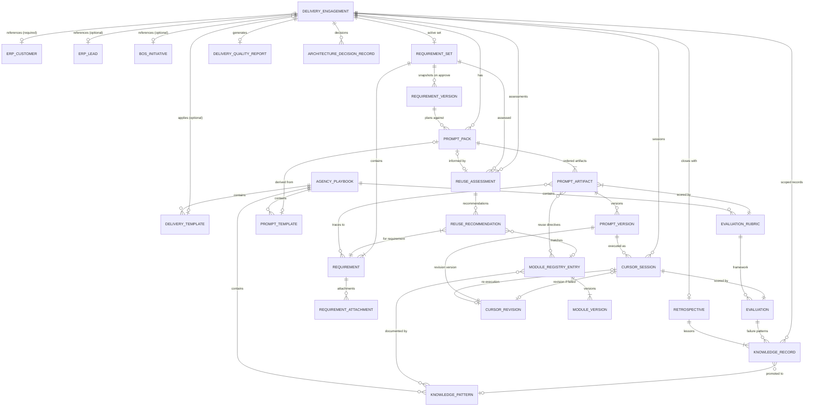

# Domain Relationship Map

Complete relationship map for all 24 AOS domain entities. Cardinality notation: `(min..max)`.

---

## Master Entity Graph

---

## Relationship Tables by Entity

### Delivery Engagement

| Relationship | Target | Cardinality | Required |
|-------------|--------|-------------|----------|
| client | ERP Customer | N:1 | **Yes** |
| originLead | ERP Lead | N:1 | No |
| strategicInitiative | BOS Initiative | N:1 | No |
| strategicVenture | BOS Venture | N:1 | No (denormalized) |
| deliveryLead | ERP User | N:1 | **Yes** |
| teamMembers | ERP User | N:M | No |
| appliedTemplate | Delivery Template | N:1 | No |
| activeRequirementSet | Requirement Set | 1:1 | Yes (before discovery exit) |
| promptPacks | Prompt Pack | 1:N | Yes (before building) |
| reuseAssessments | Reuse Assessment | 1:N | Recommended |
| cursorSessions | Cursor Session | 1:N | During building |
| evaluations | Evaluation | 1:N | During evaluating |
| retrospective | Retrospective | 1:1 | **Yes** (before close) |
| qualityReport | Delivery Quality Report | 1:1 | No |
| adrs | Architecture Decision Record | 1:N | No |
| knowledgeRecords | Knowledge Record | 1:N | No |

### Requirement Set

| Relationship | Target | Cardinality | Required |
|-------------|--------|-------------|----------|
| engagement | Delivery Engagement | N:1 | **Yes** |
| requirements | Requirement | 1:N | **Yes** (≥1) |
| versions | Requirement Version | 1:N | On approve |
| reuseAssessments | Reuse Assessment | 1:N | Recommended |
| promptPacks | Prompt Pack | 1:N | After approve |

### Requirement

| Relationship | Target | Cardinality | Required |
|-------------|--------|-------------|----------|
| requirementSet | Requirement Set | N:1 | **Yes** |
| attachments | Requirement Attachment | 1:N | No |
| reuseRecommendations | Reuse Recommendation | 1:N | No |
| promptArtifacts | Prompt Artifact | N:M | No (traceability) |
| evaluations | Evaluation | N:M | No (coverage) |

### Prompt Pack

| Relationship | Target | Cardinality | Required |
|-------------|--------|-------------|----------|
| engagement | Delivery Engagement | N:1 | **Yes** |
| requirementVersion | Requirement Version | N:1 | **Yes** |
| reuseAssessment | Reuse Assessment | N:1 | Recommended |
| artifacts | Prompt Artifact | 1:N | **Yes** (ordered) |
| sourceTemplate | Prompt Template | N:1 | No |
| sessions | Cursor Session | 1:N | During execution |

### Prompt Artifact

| Relationship | Target | Cardinality | Required |
|-------------|--------|-------------|----------|
| promptPack | Prompt Pack | N:1 | **Yes** |
| versions | Prompt Version | 1:N | On approve |
| rubric | Evaluation Rubric | N:1 | **Yes** |
| sessions | Cursor Session | 1:N | After execution |
| requirements | Requirement | N:M | No |
| moduleDirectives | Module Registry Entry | N:M | No |

### Cursor Session

| Relationship | Target | Cardinality | Required |
|-------------|--------|-------------|----------|
| promptVersion | Prompt Version | N:1 | **Yes** |
| executor | ERP User | N:1 | **Yes** |
| evaluation | Evaluation | 1:1 | After capture |
| revision | Cursor Revision | 1:1 | If failed |

### Evaluation

| Relationship | Target | Cardinality | Required |
|-------------|--------|-------------|----------|
| session | Cursor Session | 1:1 | **Yes** |
| rubric | Evaluation Rubric | N:1 | **Yes** |
| revision | Cursor Revision | 1:1 | If fail |
| knowledgeRecords | Knowledge Record | 1:N | If pattern extracted |

### Module Registry Entry

| Relationship | Target | Cardinality | Required |
|-------------|--------|-------------|----------|
| versions | Module Version | 1:N | **Yes** |
| reuseRecommendations | Reuse Recommendation | 1:N | When matched |
| knowledgePatterns | Knowledge Pattern | N:M | No |

---

## Ownership Boundaries

| Boundary | Rule |
|----------|------|
| **ERP → AOS** | AOS stores foreign keys only; hydration via read ports |
| **BOS → AOS** | AOS stores foreign keys only; hydration via read ports |
| **AOS → ERP** | No writes. ActivityLogger event emission only |
| **AOS → BOS** | No writes ever |
| **Engagement → all child entities** | Children inherit `companyId`; cascade archive on cancel |
| **Company → templates/playbook/registry** | Company-wide entities; no engagement FK |
| **Version entities** | Immutable; owned by parent mutable head |

---

## Company Isolation Matrix

| Entity | Isolation mechanism |
|--------|-------------------|
| All 24 AOS entities | `companyId` field, validated on create |
| ERP references | Port validates customer/user belongs to same company |
| BOS references | Port validates initiative belongs to same company |
| Knowledge Pattern | Client identifiers stripped on promotion |
| Module Registry | Company-scoped catalog; no cross-company entries |
| Agency Playbook | One per company |

---

## Cross-Layer Reference Summary

| AOS Entity | ERP reads | BOS reads |
|------------|-----------|-----------|
| Delivery Engagement | customer, lead, users, invoices | initiative, venture |
| Requirement | product catalog (context) | success criteria (context) |
| Reuse Assessment | via Module Registry erp_builtin entries | bos_pattern entries |
| Prompt Pack | customer summary | initiative constraints |
| Evaluation | module inventory for duplication check | — |
| Retrospective | — | initiative outcome comparison |
| Module Registry Entry | codebase paths | architecture doc paths |
| All others | — (ActivityLogger write only) | — |

---

## Many-to-Many Relationships

| Entity A | Entity B | Junction purpose |
|----------|----------|-------------------|
| Delivery Engagement | ERP User (team) | Team membership |
| Requirement | Prompt Artifact | Traceability |
| Requirement | Evaluation | Coverage matrix |
| Prompt Artifact | Module Registry Entry | Reuse directives |
| Prompt Artifact | Requirement | Traceability |
| Knowledge Record | Knowledge Pattern | Promotion evidence |
| Module Registry Entry | Knowledge Pattern | Documentation |
| Delivery Template | Prompt Template | Default templates |
| Delivery Template | Evaluation Rubric | Default rubrics |

No separate junction entities defined in Phase 0 — relationship arrays on parent entities or denormalized references. Junction entity design deferred to implementation phase if query patterns require it.

---

## Optional vs Required — Engagement Close Checklist

For a Delivery Engagement to reach `closed`, these relationships must exist:

| Relationship | Required? |
|-------------|-----------|
| ERP Customer | **Yes** (always) |
| Approved Requirement Set + Version | **Yes** |
| Approved Prompt Pack (completed) | **Yes** |
| Cursor Sessions for all artifacts | **Yes** |
| Evaluations (passing) for all sessions | **Yes** |
| Retrospective (closed) | **Yes** |
| BOS Initiative link | No |
| Reuse Assessment | Recommended |
| Delivery Quality Report | Recommended |
| ADRs | No |
