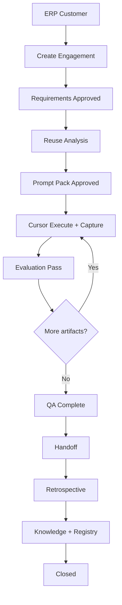

# 11 — User Flows

**Stage D0 — FXD**  
Architecture-level flows — no wireframes.

---

## Flow 1 — New Client Delivery (Happy Path)

```
ERP: Lead Won → Customer created
        │
        ▼
Founder: Dashboard → "Create engagement"
        │
        ▼
Select ERP customer → Set agency type → Create
        │
        ▼
Engagement Hub (draft/intake)
        │
        ▼
Requirements tab: Add requirements → AI analyze → Approve set
        │                              lifecycle: discovery → planning
        ▼
Reuse tab: Run scan → Accept modules
        │
        ▼
Prompts tab: AI generate pack → Review → Approve pack
        │                              lifecycle: planning → building
        ▼
Cursor tab: For each artifact:
        Copy → Execute → Capture → Evaluate pass
        │
        ▼
lifecycle: building → evaluating → delivering
        │
        ▼
QA tab: Complete checklist → Approve quality report
        │                              lifecycle: delivering → handoff
        ▼
Retrospective tab: AI draft → Approve → Promote knowledge/modules
        │
        ▼
Close engagement → lifecycle: closed
```

---

## Flow 2 — Founder Morning Check-In

```
Open AOS Dashboard
        │
        ▼
Review Attention Queue (max 7)
        │
        ├── Approval needed? → Open engagement tab → Decide
        ├── Evaluation failed? → Review → Iterate or override
        └── All clear? → Review "Next Best Action" card → Continue engagement
```

**Duration target:** < 2 minutes to know daily priority.

---

## Flow 3 — Failed Evaluation Iteration

```
Cursor tab: Session capture submitted
        │
        ▼
Evaluation tab: AI scores → FAIL
        │
        ▼
Founder/Developer: Review failure analysis
        │
        ▼
AI generates revision prompt → Human approves revision
        │
        ▼
Cursor tab: Re-execute revised artifact
        │
        ▼
New capture → Re-evaluate
        │
        ├── Pass → Next artifact
        └── Fail → Repeat (history preserved)
```

---

## Flow 4 — Reuse-First Planning

```
Requirements approved
        │
        ▼
Reuse tab: AI scan against Registry
        │
        ├── High match → Select modules → Prompt pack references modules
        └── Low match → Document net-new justification
        │
        ▼
Prompt generation includes reuse context
```

---

## Flow 5 — Pause and Resume

```
Engagement Hub: Active work in building
        │
        ▼
Founder: Pause (client delay)
        │          lifecycle: → paused (pausedFromState preserved)
        ▼
Dashboard: Shows paused — not hidden
        │
        ▼
[Time passes]
        │
        ▼
Founder: Resume
        │          lifecycle: paused → previous state
        ▼
Continue Cursor workflow
```

---

## Flow 6 — Cancel Engagement

```
Engagement Hub: Any non-terminal state
        │
        ▼
Founder: Cancel → Enter reason (required)
        │          lifecycle: → cancelled
        ▼
Record preserved — listable, auditable
        │
        ▼
No physical delete (ADR-014)
```

---

## Flow 7 — Cross-Engagement Approval Queue

```
Founder: Sidebar → Prompts queue
        │
        ▼
See 3 engagements with draft packs
        │
        ▼
Click first → Engagement Prompts tab
        │
        ▼
Review → Approve → Return to queue
```

Same pattern for Requirements and Evaluation queues.

---

## Flow 8 — Knowledge Compounding

```
Engagement closed with retrospective approved
        │
        ▼
AI extracts knowledge candidates
        │
        ▼
Founder: Knowledge library → Review promotions
        │
        ▼
Next engagement intake:
        AI context includes promoted patterns
```

---

## Flow 9 — ERP Sidecar (Read Only)

```
Engagement Hub: Client name link
        │
        ▼
Navigate to ERP Customer Detail (external)
        │
        ▼
View invoices, contacts — no AOS write
        │
        ▼
Return to AOS — engagement unchanged except explicit AOS actions
```

---

## Flow 10 — BOS Strategic Context

```
Create/Edit engagement: Link BOS initiative
        │
        ▼
AOS reads initiative summary (ventureId, status)
        │
        ▼
Engagement Hub shows strategic context banner
        │
        ▼
BOS link opens BOS initiative (read-only from AOS)
```

---

## Flow Dependency Graph



---

## Related Documents

- [01 Founder Journey](./01_FOUNDER_JOURNEY.md)
- [02 Screen Architecture](./02_SCREEN_ARCHITECTURE.md)
- [06 Cursor Workflow](./06_CURSOR_WORKFLOW.md)
