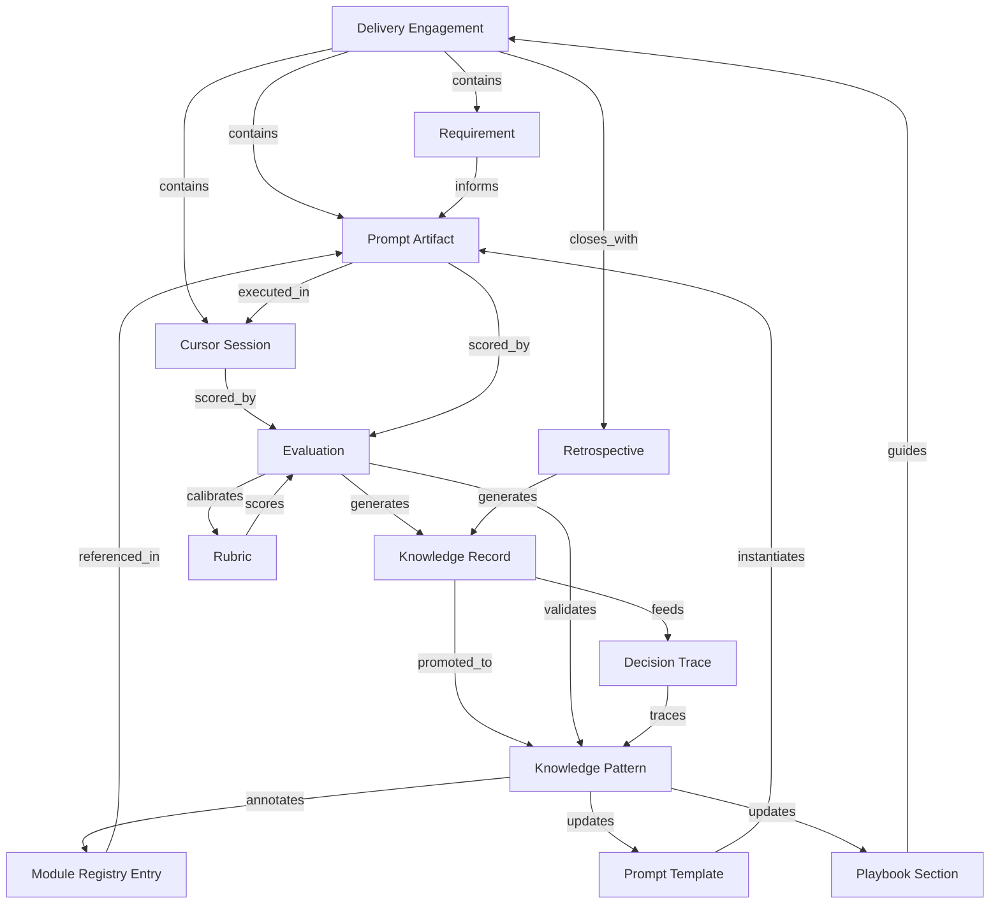

# 01 — Organizational Knowledge Graph

**Stage D2.6 — Knowledge Intelligence Layer**

---

## Purpose

Define the **Organizational Knowledge Graph (OKG)** — the connected model of every major AOS artifact and how they relate across engagements, time, and promotion cycles.

The OKG is the structural substrate for 10+ year organizational intelligence. The Knowledge Engine **stores** artifacts; the Knowledge Intelligence Layer **connects** them into a queryable, measurable, evolvable graph.

This is not a replacement for domain entities or Firestore collections. It is the **semantic overlay** that makes organizational knowledge navigable and reason-able.

---

## Graph Architecture

### Layer model

```
┌────────────────────────────────────────────────────────────────────────┐
│                    ORGANIZATIONAL KNOWLEDGE GRAPH                       │
│                                                                         │
│  ┌─────────────────────────────────────────────────────────────────┐   │
│  │ L4 — INTELLIGENCE (KIL)                                          │   │
│  │  Health metrics · External change nodes · Reasoning paths        │   │
│  └───────────────────────────────┬─────────────────────────────────┘   │
│                                  │                                      │
│  ┌───────────────────────────────▼─────────────────────────────────┐   │
│  │ L3 — PROMOTED ASSETS (agency-wide, durable)                      │   │
│  │  Knowledge Pattern · Module Registry Entry · Prompt Template     │   │
│  │  Playbook Section · Rubric · Architecture Decision               │   │
│  └───────────────────────────────┬─────────────────────────────────┘   │
│                                  │ derived_from / validated_by          │
│  ┌───────────────────────────────▼─────────────────────────────────┐   │
│  │ L2 — EVIDENCE (engagement-scoped, append-only)                   │   │
│  │  Knowledge Record · Evaluation · Cursor Session · Decision Trace │   │
│  └───────────────────────────────┬─────────────────────────────────┘   │
│                                  │ originated_from                      │
│  ┌───────────────────────────────▼─────────────────────────────────┐   │
│  │ L1 — DELIVERY ARTIFACTS (workflow objects)                       │   │
│  │  Requirement · Prompt (artifact) · Reuse Assessment              │   │
│  └───────────────────────────────┬─────────────────────────────────┘   │
│                                  │ belongs_to                           │
│  ┌───────────────────────────────▼─────────────────────────────────┐   │
│  │ L0 — ROOT CONTEXT                                                │   │
│  │  Delivery Engagement · Retrospective · Company                   │   │
│  └─────────────────────────────────────────────────────────────────┘   │
└────────────────────────────────────────────────────────────────────────┘
```

### Node types (canonical)

| Node | Layer | Graph role |
|------|-------|------------|
| **Delivery Engagement** | L0 | Root container; scopes evidence |
| **Retrospective** | L0 | Learning trigger; closes evidence bundle |
| **Requirement** (versioned) | L1 | Defines need; links to prompts |
| **Prompt** (artifact, versioned) | L1 | Execution instruction |
| **Cursor Session** | L1 | Execution record |
| **Evaluation** | L2 | Quality evidence |
| **Knowledge Record** | L2 | Raw captured insight |
| **Decision Trace** | L2 | Governance chain |
| **Knowledge Pattern** | L3 | Promoted agency learning |
| **Module Registry Entry** | L3 | Reusable asset |
| **Prompt Template** | L3 | Reusable prompt baseline |
| **Playbook** (section) | L3 | Process knowledge |
| **Rubric** | L3 | Evaluation standard |
| **External Change Event** (future) | L4 | Platform/SDK deprecation signal |

Each node carries: `nodeId`, `nodeType`, `companyId`, `layer`, `confidence` (where applicable), `version`, `lifecycleState`, `domainTags[]`.

### Edge types

See [02_KNOWLEDGE_RELATIONSHIPS.md](02_KNOWLEDGE_RELATIONSHIPS.md) for full semantics. Core edges:

| Edge | Example |
|------|---------|
| `belongs_to` | Prompt → Engagement |
| `derived_from` | Knowledge Pattern → Knowledge Record[] |
| `validated_by` | Knowledge Pattern → Evaluation[] |
| `supports` | Module → Requirement category |
| `supersedes` | Prompt Template v3 → v2 |
| `contradicts` | Pattern A ↔ Pattern B (requires resolution) |

---

## Relationship Map (Major Artifacts)



---

## Graph Traversal Examples

### Example 1 — "Why does this pattern exist?"

**Question:** Delivery lead asks why active pattern `KP-042` ("Firebase compat SDK required") is in constraints.

**Traversal:**

```
Knowledge Pattern (KP-042)
    ← derived_from ── Knowledge Record (KR-118, KR-203)
    ← validated_by ── Evaluation (EVA-89 fail, EVA-102 pass after fix)
    ← originated_from ── Retrospective (RET-15)
    ← belongs_to ── Delivery Engagement (ENG-15)
    ← traces ── Decision Trace (DT-44: approved by lead)
```

**Output:** Evidence bundle with anonymized summary — not keyword search.

---

### Example 2 — "What breaks if we deprecate module M-auth?"

**Question:** Technical reviewer considers deprecating `Module Registry Entry M-auth`.

**Traversal:**

```
Module Registry Entry (M-auth)
    ← referenced_in ── Prompt Artifact[] (last 12 months)
    ← supports ── Knowledge Pattern[] (auth domain)
    ← validated_by ── Evaluation[] (pass rate 94%)
    → contradicts ── Pattern KP-07? (check)
    ← affected_by ── External Change Event? (Firebase SDK update)
    ← used_in ── Engagement[] (count, not client names)
```

**Output:** Impact report — prompts affected, patterns stale risk, eval history, recommended deprecation sequence.

---

### Example 3 — "What did we learn from SaaS engagements last quarter?"

**Question:** Agency owner reviews SaaS delivery intelligence.

**Traversal:**

```
Filter: domain=Delivery, agencyType=SaaS, time=Q2
    ← belongs_to ── Engagement[] 
    ← closes_with ── Retrospective[]
    → promoted_to ── Knowledge Pattern[] (new in Q2)
    → registered ── Module Registry Entry[] (new)
    → updated ── Prompt Template[] (version bumps)
    Aggregate: Learning Engine metrics (read-only)
```

**Output:** Quarterly learning summary — graph aggregation, not spreadsheet export.

---

### Example 4 — "Find conflicting guidance for Stripe integration"

**Question:** Prompt Engine assembly detects two patterns about Stripe webhooks.

**Traversal:**

```
Search: domain=Backend, tags=[Stripe, webhooks]
    → Knowledge Pattern[] (KP-31, KP-88)
    ↔ contradicts edge between KP-31 and KP-88
    ← validated_by ── Evaluation[] (conflicting pass/fail contexts)
    ← superseded_by? ── check version chain
```

**Output:** Conflict resolution queue — human merges or supersedes; Decision Trace updated.

---

## Future AI Reasoning Over the Graph

The OKG enables **path-based reasoning** instead of flat retrieval:

| Capability | Graph use |
|------------|-----------|
| **Evidence grounding** | Every AI claim must cite traversable path to Evaluation or Record |
| **Impact simulation** | Traverse downstream from node before deprecation |
| **Confidence propagation** | Boost pattern confidence when multiple independent paths validate |
| **Gap detection** | Find Requirement categories with no `supports` edge from Module or Pattern |
| **Temporal reasoning** | Compare subgraph at T0 vs T1 for drift detection |
| **External change ripple** | Insert External Change Event node; traverse `affected_by` edges |

AI does **not** mutate graph edges without human-approved Learning Engine promotion. KIL reasoning is **read-mostly** with intelligence **events** that trigger human review.

See [06_AI_REASONING_LAYER.md](06_AI_REASONING_LAYER.md).

---

## Ownership

| Aspect | Owner |
|--------|-------|
| Graph schema (node/edge types) | AOS Knowledge Intelligence Layer (governance) |
| Node content | Respective engines (KE, Registry, Prompt, etc.) |
| Edge creation (promotion) | Learning Engine (approved promotions create edges) |
| Edge creation (automatic) | KIL pipeline (structural edges: belongs_to, executed_in) |
| Graph queries | KIL read API (future) |

---

## Boundaries

| KIL owns | KIL does not own |
|----------|------------------|
| Graph topology semantics | Artifact CRUD (domain engines) |
| Relationship types | Promotion approval (Learning Engine) |
| Traversal query patterns | Ingestion pipeline (Knowledge Engine) |
| Health over graph | Raw storage schema (implementation) |

---

## Failure Cases

| Failure | Response |
|---------|----------|
| Orphan node (no edges) | Health alert: incomplete graph linkage |
| Circular contradicts without resolution | Block pattern from auto-injection |
| Broken derived_from chain | Promotion integrity alert |
| Client PII in node metadata | Block node from agency-wide traversals |
| Graph drift from domain | Reconciliation job |

---

## Related Documents

- [02_KNOWLEDGE_RELATIONSHIPS.md](02_KNOWLEDGE_RELATIONSHIPS.md)
- [04_KNOWLEDGE_HEALTH.md](04_KNOWLEDGE_HEALTH.md)
- [06_AI_REASONING_LAYER.md](06_AI_REASONING_LAYER.md)
- `docs/aos-learning-engine/17_DECISION_TRACEABILITY.md`
