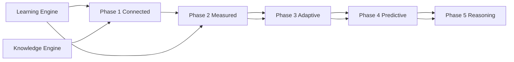

# 07 — Intelligence Roadmap

**Stage D2.6 — Knowledge Intelligence Layer**

---

## Purpose

Define a **10+ year phased roadmap** for organizational intelligence — from manual graph linkage through autonomous health monitoring and graph-based AI reasoning — without committing implementation details prematurely.

Phases are **capability milestones**, not calendar dates. Advance when prior phase health metrics meet thresholds.

---

## Phase Overview

| Phase | Theme | Organizational intelligence capability |
|-------|-------|----------------------------------------|
| **1** | Connected corpus | Graph exists; structural edges; manual health |
| **2** | Measured corpus | Health metrics; domain taxonomy; review queues |
| **3** | Adaptive corpus | External change intelligence; conflict detection |
| **4** | Predictive corpus | Drift prediction; gap forecasting; eval spike detection |
| **5** | Reasoning corpus | Graph-native AI; continuous monitors; training loop |

---

## Phase 1 — Connected Corpus

**Goal:** Every major artifact is a graph node with structural relationships.

### Capabilities

| Capability | Description |
|------------|-------------|
| OKG schema | Node types L0–L3 defined (doc 01) |
| Structural edges | Auto `belongs_to`, `executed_in`, `scored_by`, `instantiates` |
| Promotion edges | Learning Engine creates `derived_from`, `supersedes` on approve |
| Manual graph export | Engagement subgraph export for audit |
| Rule-based traversal | Fixed queries (Examples 1–2, doc 01) — no LLM |

### Reads from

- Learning Engine promotion events
- Knowledge Engine records
- Domain workflow artifacts

### Does not include

- AI reasoning
- External change feeds
- Automated health dashboard
- Semantic duplicate detection

### Exit criteria

| Metric | Target |
|--------|--------|
| Knowledge Completeness | ≥ 90% closed engagements |
| Promotion edges present | 100% active patterns have `derived_from` |
| Decision Trace linked | 100% promotions |

---

## Phase 2 — Measured Corpus

**Goal:** Organization knows if knowledge is healthy.

### Capabilities

| Capability | Description |
|------------|-------------|
| Domain taxonomy live | All L3 nodes classified (doc 05) |
| Core health metrics | Freshness, Coverage, Confidence Distribution, Review Backlog, Debt |
| Health dashboard (read-only) | Segment by domain and agency type |
| Duplicate detection (suggest) | `duplicate_of` candidates — human merge |
| Quarterly health review | Operational ritual |

### Reads from

- Phase 1 graph
- Learning Engine metrics (aggregate)
- Knowledge Engine retrieval stats

### Exit criteria

| Metric | Target |
|--------|--------|
| Domain coverage defined | 100% L3 nodes have primary domain |
| Freshness | ≥ 60% (maturing agency) |
| Knowledge Debt | Stable or ↓ two quarters |

---

## Phase 3 — Adaptive Corpus

**Goal:** Corpus adapts to external and internal change.

### Capabilities

| Capability | Description |
|------------|-------------|
| External Change Events | Manual + selected feeds (doc 03) |
| `affected_by` propagation | Impact traversal |
| Stale cascade | ECE → stale candidates |
| Conflict detection | Active `contradicts` queue |
| Mitigation linking | `mitigated_by` after Learning promotion |
| Internal platform change | ERP/BOS change triggers |

### Reads from

- Phase 2 health baseline
- Advisory feeds (future infra)
- Evaluation failure clusters

### Exit criteria

| Metric | Target |
|--------|--------|
| Critical ECE review SLA | ≥ 95% on time |
| Unresolved contradicts | 0 active pairs |
| Stale patterns in auto-injection | 0 |

---

## Phase 4 — Predictive Corpus

**Goal:** Detect problems before they compound.

### Capabilities

| Capability | Description |
|------------|-------------|
| Eval failure spike detection | Implicit external break signal |
| Gap forecasting | Requirement categories trending unmatched |
| Drift detection | Subgraph comparison quarter-over-quarter |
| Promotion bottleneck prediction | Backlog growth forecast |
| Learning velocity forecast | Flywheel slowdown alert |
| Domain blind spot alerts | Diversity threshold breaches |

### Reads from

- Phase 3 change graph
- Historical metrics time series
- Delivery intelligence metrics (LE doc 14)

### Exit criteria

| Metric | Target |
|--------|--------|
| True positive rate (spike detection) | Validated on retrospective review |
| False alert rate | Below agreed ops threshold |
| Knowledge ROI | Positive trend |

---

## Phase 5 — Reasoning Corpus

**Goal:** AI reasons over graph natively; agency intelligence compounds exponentially.

### Capabilities

| Capability | Description |
|------------|-------------|
| Intent-based graph plans | doc 06 patterns |
| Grounded prompt context | R2+ injection tiers |
| Continuous reasoning monitors | Background traversals for debt/contradicts/stale |
| Training corpus export | LE doc 20 + graph labels |
| Cross-agency pattern sharing | Optional, governed, anonymized |
| Self-calibration loop | Rejection labels → model improvement |

### Governance (permanent)

- Human promotion required (ADR-009)
- Client isolation
- Append-only audit
- No auto-promotion

### Exit criteria

| Metric | Target |
|--------|--------|
| Retrieval hit rate (graph vs keyword) | Graph ≥ keyword + 30% |
| Grounded answer rate | ≥ 95% claims with node citations |
| First-pass eval rate | ↑ vs Phase 1 baseline |
| Reuse rate | ↑ vs Phase 1 baseline |

---

## Cross-Phase Dependencies

Learning Engine and Knowledge Engine **must be operational** before Phase 1 completes meaningfully. KIL Phase 1 can begin in parallel with Learning Engine implementation (M13+) but requires promotion events for L3 edges.

---

## Relationship to AOS Product Phases

| AOS product phase (`08_KNOWLEDGE_ENGINE.md`) | KIL phase |
|---------------------------------------------|-----------|
| Phase 1 — Manual lesson + bootstrap | KIL Phase 1 start |
| Phase 2 — Auto eval capture | KIL Phase 1–2 |
| Phase 3 — Retrieval for prompts | KIL Phase 2–3 |
| Phase 4 — Doc generation + promotion workflow | KIL Phase 3 |
| Phase 5 — Stale detection + cross-agency | KIL Phase 4–5 |

Product and KIL phases align but KIL extends beyond product Phase 5 for reasoning.

---

## What Never Changes Across Phases

| Permanent law | Source |
|---------------|--------|
| Human-governed promotion | ADR-009 |
| Client facts never cross engagements | ADR-009 |
| Append-only evidence | ADR-014 |
| Learning vs surveillance | LE + CL docs |
| KIL read-mostly; LE writes promotions | D2.5/D2.6 |

---

## Related Documents

- [04_KNOWLEDGE_HEALTH.md](04_KNOWLEDGE_HEALTH.md)
- [06_AI_REASONING_LAYER.md](06_AI_REASONING_LAYER.md)
- [08_FINAL_INTELLIGENCE_REPORT.md](08_FINAL_INTELLIGENCE_REPORT.md)
- `docs/aos-learning-engine/07_INTELLIGENCE_ROADMAP.md` — **does not exist**; LE has flywheel timing only

---

## Open Implementation Dependencies

| Dependency | Required for |
|------------|--------------|
| Learning Engine promotion events | Phase 1 edges |
| Graph storage (implementation TBD) | All phases |
| Health analytics jobs | Phase 2+ |
| External feed infrastructure | Phase 3+ |
| LLM orchestration | Phase 5 |

None are implemented in D2.6.
