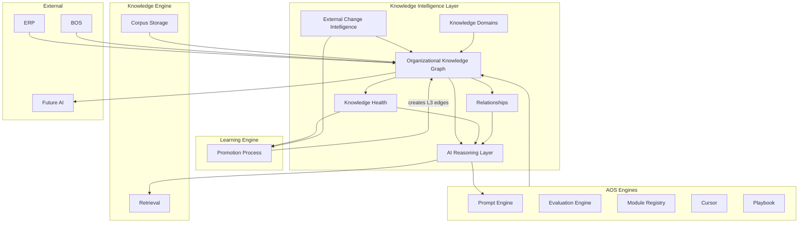

# 08 — Final Intelligence Report

**Stage D2.6 — Knowledge Intelligence Layer**  
**Date:** July 19, 2026  
**Status:** Complete — final documentation sprint before implementation resumes  
**Scope:** Documentation only

---

## Executive Summary

The **Knowledge Intelligence Layer (KIL)** is the architectural stratum that sits **above** the Learning Engine and Knowledge Engine to connect, reason about, measure, and evolve **organizational intelligence** over a 10+ year horizon.

| Layer | One-line role |
|-------|---------------|
| **Continuous Learning** | The compounding outcome — faster, better delivery |
| **Learning Engine** | The process — extract, approve, promote after retrospective |
| **Knowledge Engine** | The corpus — ingest, classify, store, retrieve |
| **Knowledge Intelligence Layer** | The connective tissue — graph, relationships, health, external change, future reasoning |

The KIL is **not another engine**. It does not duplicate promotion workflows, ingestion pipelines, or storage design. It provides the **Organizational Knowledge Graph**, semantic relationships, knowledge health intelligence, external change propagation model, domain taxonomy, AI reasoning architecture, and phased roadmap.

**Deliverable:** 8 documents in `docs/aos-knowledge-intelligence/`.

---

## 1. Architecture

### 1.1 Stack position

```
┌─────────────────────────────────────────────────────────────────────┐
│                    KNOWLEDGE INTELLIGENCE LAYER                      │
│  Organizational Knowledge Graph · Relationships · Health Metrics     │
│  External Change Intelligence · Domain Taxonomy · AI Reasoning       │
└───────────────────────────────┬─────────────────────────────────────┘
                                │ read / measure / connect / alert
        ┌───────────────────────┼───────────────────────┐
        ▼                       ▼                       ▼
┌───────────────┐       ┌───────────────┐       ┌───────────────────┐
│ Learning      │       │ Knowledge     │       │ AOS Delivery      │
│ Engine        │──────→│ Engine        │←──────│ Engines           │
│ (promotion    │       │ (corpus)      │       │ Prompt·Eval·Module│
│  process)     │       │               │       │ Cursor·Playbook   │
└───────────────┘       └───────────────┘       └───────────────────┘
        ▲                       ▲
        │                       │
        └──────── Continuous Learning (outcome) ────────┘
```

### 1.2 Data philosophy

| Principle | Implementation |
|-----------|----------------|
| Artifacts are nodes | Engagement, Pattern, Module, etc. |
| Meaning is in edges | `derived_from`, `validated_by`, `contradicts` |
| Health is computed | Freshness, Debt, Coverage — not stored as truth |
| Change is explicit | External Change Event nodes |
| Reasoning is grounded | Traversal paths, not keywords |
| Mutation is governed | Learning Engine promotes; KIL alerts |

### 1.3 Core workflow (intelligence, not learning)

```
Corpus changes (Learning Engine promotion, workflow capture)
        │
        ▼
KIL updates graph edges (structural automatic; promotion from LE events)
        │
        ▼
Health metrics recomputed
        │
        ├── Healthy → available for retrieval / reasoning
        ├── Stale / contradict / ECE → intelligence event → review queue
        └── Gap detected → advisory to Learning Engine (not auto-create)
        │
        ▼
Future AI reasoning (Phase 5) traverses graph for grounded answers
        │
        ▼
Future engagements benefit from connected, measured, trusted knowledge
```

---

## 2. Architecture Diagrams

### 2.1 Organizational Knowledge Graph layers

```
L4  Intelligence     [ External Change · Health Signals · Reasoning Queries ]
                              │
L3  Promoted Assets  [ Knowledge Pattern · Module · Prompt Template · Playbook · Rubric ]
                              │ derived_from / validated_by
L2  Evidence         [ Knowledge Record · Evaluation · Decision Trace ]
                              │ originated_from
L1  Delivery         [ Requirement · Prompt Artifact · Cursor Session ]
                              │ belongs_to
L0  Root             [ Delivery Engagement · Retrospective ]
```

### 2.2 External change ripple

```
External Change Event
        │
        ├─ affected_by ─→ Module Registry entries
        ├─ affected_by ─→ Knowledge Patterns
        ├─ affected_by ─→ Prompt Templates
        ├─ affected_by ─→ Playbook sections
        └─ triggers_review ─→ Rubrics
                │
                ▼
        Health: Freshness↓  Debt↑
                │
                ▼
        Human review (NOT auto-fix)
                │
                ▼
        Learning Engine promotion (mitigation pattern, supersede, deprecate)
```

---

## 3. Dependency Graph

### 3.1 KIL depends on (upstream)

| System | Dependency | Hard/Soft |
|--------|------------|-----------|
| Learning Engine | Promotion events for L3 edges | Hard (Phase 1+) |
| Knowledge Engine | Records, patterns, retrieval stats | Hard |
| Delivery workflow | L0–L1 artifacts | Hard |
| Evaluation Engine | `validated_by` evidence | Hard |
| Module Registry | L3 module nodes | Hard |
| Prompt Engine | Templates, artifacts | Hard |
| Decision Trace | Governance chain | Hard |
| ERP ActivityLogger | Audit correlation | Soft |
| BOS | Strategic context (read) | Optional |

### 3.2 Depends on KIL (downstream)

| Consumer | Uses KIL for |
|----------|--------------|
| Future health dashboard | Metrics (doc 04) |
| Future prompt assembly | Domain-scoped graph retrieval (Phase 3+) |
| Future AI orchestration | Reasoning layer (doc 06) |
| Learning Engine (advisory) | Gap/conflict signals — not control |
| Agency leadership | Quarterly intelligence review |
| External change ops | Impact reports |

### 3.3 Dependency diagram



---

## 4. System Interactions

### 4.1 ERP

| Interaction | Direction | Purpose |
|-------------|-----------|---------|
| ActivityLogger events | AOS → ERP | Correlate graph mutations with audit |
| Auth / company scope | ERP → KIL | All graph queries scoped by company |
| Customer data | ERP → KIL | **Never** in agency-wide graph traversals |

KIL does not own ERP data. Client context remains ERP read port per engagement.

### 4.2 BOS

| Interaction | Direction | Purpose |
|-------------|-----------|---------|
| Initiative lessons | BOS → KIL (read) | Strategic nodes optional in graph |
| ROI outcomes | BOS → KIL (read) | Knowledge ROI context |
| Write-back | — | **None** — AOS does not write BOS |

### 4.3 AOS (Delivery)

| Interaction | Purpose |
|-------------|---------|
| Workflow artifacts | L0–L1 graph nodes |
| Retrospective close | Completes engagement subgraph |
| Engagement scope | Root for all traversals |

### 4.4 Learning Engine

| Interaction | Purpose |
|-------------|---------|
| Promotion approved | Creates `derived_from`, `supersedes`, `annotates` edges |
| Metrics (read) | Promotion bottleneck, velocity for health |
| Advisory (KIL → LE) | Gap/conflict signals as **candidates only** |

**No overlap:** LE owns extraction, gates, approval, promotion execution. KIL owns graph semantics and health.

### 4.5 Knowledge Engine

| Interaction | Purpose |
|-------------|---------|
| Records & patterns | L2–L3 nodes |
| Retrieval stats | Dead knowledge, hit rate |
| Classification tags | Domain assignment input |

**No overlap:** KE owns ingestion, storage, retrieval service. KIL owns relationships and health over stored artifacts.

### 4.6 Prompt Engine

| Interaction | Purpose |
|-------------|---------|
| Templates & artifacts | L3/L1 nodes |
| Context assembly (future) | Domain-scoped graph retrieval (Phase 3+) |
| Template stale | External change propagation |

### 4.7 Evaluation Engine

| Interaction | Purpose |
|-------------|---------|
| Evaluations | L2 evidence nodes |
| `validated_by` edges | Trust metric backbone |
| Rubrics | L3 nodes; stale on standard changes |

### 4.8 Module Registry

| Interaction | Purpose |
|-------------|---------|
| Entries | L3 nodes |
| Impact traversal | Deprecation analysis |
| Quality scores | Module health input |

### 4.9 Playbook

| Interaction | Purpose |
|-------------|---------|
| Sections | L3 nodes |
| Checklist coverage | Gap analysis via `supports` edges |

### 4.10 Cursor

| Interaction | Purpose |
|-------------|---------|
| Sessions | L1 nodes |
| Execution evidence | Links to eval and learning |

### 4.11 Future AI

| Interaction | Purpose |
|-------------|---------|
| Graph reasoning | doc 06 patterns |
| Grounded outputs | Citation paths required |
| Training labels | Graph structure + LE rejections (LE doc 20) |

Future AI **reads** KIL; **writes** only via Learning Engine human-approved paths.

---

## 5. Overlap Verification

### 5.1 vs Learning Engine (`docs/aos-learning-engine/`)

| Topic | Learning Engine | KIL | Overlap? |
|-------|-----------------|-----|----------|
| Post-retrospective extraction | ✅ Owns | — | No |
| Promotion rules | ✅ Owns | — | No |
| Approval workflow | ✅ Owns | — | No |
| Quality gates (promotion) | ✅ Owns | — | No |
| Learning metrics (process) | ✅ Owns | Reads aggregate | No |
| Graph edges on promote | Creates via process | Defines semantics | **Complement** |
| Conflict detection | — | ✅ Owns | No |
| External change | — | ✅ Owns | No |
| Health metrics (corpus) | — | ✅ Owns | No |

### 5.2 vs Knowledge Engine (`docs/aos-architecture/08_KNOWLEDGE_ENGINE.md`)

| Topic | Knowledge Engine | KIL | Overlap? |
|-------|------------------|-----|----------|
| Ingestion pipeline | ✅ Owns | — | No |
| Storage | ✅ Owns | — | No |
| Retrieval service | ✅ Owns | Enhances with graph (future) | **Complement** |
| Taxonomy (basic tags) | ✅ Owns | Domain registry authority | **Complement** |
| Promotion flow (concept) | Describes | LE executes; KIL connects result | **Complement** |
| Knowledge graph | — | ✅ Owns | No |
| Health dashboard | — | ✅ Owns | No |

### 5.3 Complementarity verdict

**PASS** — KIL complements existing architecture. It does not replace Learning Engine, Knowledge Engine, or any delivery engine.

---

## 6. Readiness Verdict

| Area | Verdict | Notes |
|------|---------|-------|
| Graph architecture | **Ready for Phase 1 design** | Node/edge types defined |
| Relationship semantics | **Ready** | Full catalog in doc 02 |
| External change model | **Ready for Phase 3 planning** | No feeds yet |
| Health metrics | **Ready for Phase 2 analytics spec** | 16 metrics defined |
| Domain taxonomy | **Ready** | Tier 1–4 classification |
| AI reasoning | **Ready for Phase 5 planning** | Patterns defined |
| Roadmap | **Ready** | Phases 1–5 with exit criteria |
| Domain model extension | **Deferred** | New entities need future ADR |
| Graph storage | **Deferred** | Implementation sprint |
| UI (health dashboard) | **Deferred** | M16+ |

**Overall:** Documentation complete. Implementation may resume with Learning Engine backend (M13+) and KIL Phase 1 graph edge emission in parallel.

---

## 7. Risks

| Risk | Severity | Mitigation |
|------|----------|------------|
| Graph complexity exceeds team capacity | Medium | Phase 1 structural edges only |
| Health metric fatigue | Medium | Composite score + drill-down |
| False external change alerts | Medium | Severity matrix; human dismiss |
| Reasoning hallucination | High | Grounded paths mandatory (doc 06) |
| Graph storage cost at 10 years | Medium | Retention tiers (LE doc 19) |
| Duplication with KE retrieval | Low | Clear boundary — KE stores, KIL connects |
| Premature Phase 5 AI | High | Roadmap gates on Phase 1–4 exit criteria |

---

## 8. Open Questions

| # | Question | Owner | Target phase |
|---|----------|-------|--------------|
| 1 | Graph storage: property graph DB vs Firestore adjacency vs hybrid? | Architecture | Pre-Phase 1 impl |
| 2 | Real-time vs batch health recomputation? | Engineering | Phase 2 |
| 3 | Which external feeds first (npm vs GitHub vs manual)? | Ops | Phase 3 |
| 4 | Graph query API surface for Prompt Engine? | Prompt + KIL | Phase 3 |
| 5 | New domain entities for External Change Event — ADR required? | Architecture | Pre-Phase 3 |
| 6 | Cross-agency graph sharing anonymization standard? | Governance | Phase 5 |
| 7 | Health dashboard vs Registry/Knowledge UI ordering? | Product | M14–M16 |

---

## 9. Future Work (Post-D2.6)

| Work item | Phase | Depends on |
|-----------|-------|------------|
| Emit structural graph edges from workflow | 1 | Delivery + workflow persistence |
| Learning Engine promotion → graph edge writer | 1 | LE implementation |
| Domain classification on promotion | 2 | KIL + LE integration |
| Health analytics jobs | 2 | Graph populated |
| Manual External Change Event entry UI | 3 | ST-12+ or admin |
| Advisory feed integration | 3 | Infrastructure |
| Conflict resolution queue UI | 3 | KIL events |
| Graph-based prompt context API | 3 | Prompt Engine |
| Predictive monitors | 4 | Metrics history |
| AI reasoning orchestration | 5 | LLM + graph API |

**Explicitly not started:** Any code, domain, Firestore, UI, or infrastructure.

---

## 10. Architecture Audit (Validation)

### 10.1 Modification check

| Area | Modified? | Evidence |
|------|-----------|----------|
| Application code | **No** | No files under `aos/application/` changed in D2.6 |
| Domain | **No** | No domain model changes |
| Infrastructure | **No** | No infra changes |
| Firestore | **No** | No schema changes |
| React / UI | **No** | No component changes |
| Routes | **No** | No route changes |
| Existing ADRs | **No** | ADR files untouched |
| Existing documentation | **No rewrites** | Only new folder added |

### 10.2 Deliverable check

| Document | Created |
|----------|---------|
| `00_INDEX.md` | ✅ |
| `01_ORGANIZATIONAL_KNOWLEDGE_GRAPH.md` | ✅ |
| `02_KNOWLEDGE_RELATIONSHIPS.md` | ✅ |
| `03_EXTERNAL_CHANGE_INTELLIGENCE.md` | ✅ |
| `04_KNOWLEDGE_HEALTH.md` | ✅ |
| `05_KNOWLEDGE_DOMAINS.md` | ✅ |
| `06_AI_REASONING_LAYER.md` | ✅ |
| `07_INTELLIGENCE_ROADMAP.md` | ✅ |
| `08_FINAL_INTELLIGENCE_REPORT.md` | ✅ (this file) |

### 10.3 Complementarity check

| Check | Result |
|-------|--------|
| No overlap with Learning Engine | **PASS** (§5.1) |
| No overlap with Knowledge Engine | **PASS** (§5.2) |
| Complements frozen architecture | **PASS** |
| Does not replace any engine | **PASS** |
| ADR-009 human promotion preserved | **PASS** |
| ADR-014 append-only preserved | **PASS** |

### 10.4 Implementation boundary

| Rule | Status |
|------|--------|
| Documentation only | **PASS** |
| Stop after documentation | **PASS** |
| No implementation begun | **PASS** |

---

## 11. Document Index

```
docs/aos-knowledge-intelligence/
├── 00_INDEX.md
├── 01_ORGANIZATIONAL_KNOWLEDGE_GRAPH.md
├── 02_KNOWLEDGE_RELATIONSHIPS.md
├── 03_EXTERNAL_CHANGE_INTELLIGENCE.md
├── 04_KNOWLEDGE_HEALTH.md
├── 05_KNOWLEDGE_DOMAINS.md
├── 06_AI_REASONING_LAYER.md
├── 07_INTELLIGENCE_ROADMAP.md
└── 08_FINAL_INTELLIGENCE_REPORT.md
```

---

## 12. Sign-off

| Deliverable | Status |
|-------------|--------|
| D2.6 Knowledge Intelligence Layer | **Complete** |
| Implementation | **Not started** (by design) |
| Prior D2.5 Learning Engine docs | **Unmodified** |
| Prior Knowledge Engine docs | **Unmodified** |

**Stage D2.6 complete. STOP — documentation only sprint finished.**

---

## Appendix — Three-Layer Reference Card

```
┌─────────────────────────────────────────────────────────┐
│  CONTINUOUS LEARNING — "Are we getting faster?"         │
├─────────────────────────────────────────────────────────┤
│  LEARNING ENGINE — "How do we promote lessons?"         │
├─────────────────────────────────────────────────────────┤
│  KNOWLEDGE ENGINE — "Where is knowledge stored?"        │
├─────────────────────────────────────────────────────────┤
│  KNOWLEDGE INTELLIGENCE — "How is knowledge connected,  │
│   healthy, and reasoned over?"                          │
└─────────────────────────────────────────────────────────┘
```
