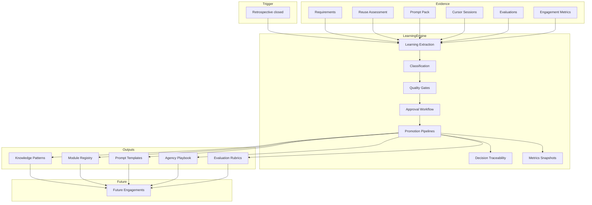

# Learning Engine — Final Architecture Report

**Stage D2.5 — Learning Engine & Continuous Improvement Architecture**  
**Date:** July 19, 2026  
**Status:** Complete — final documentation sprint before implementation resumes  
**Scope:** Documentation only — no code, domain, infrastructure, or UI changes

---

## Executive Summary

The **AOS Learning Engine** is the governed process that converts closed retrospectives into **organizational learning** — not merely stored notes. It activates **after Retrospective closure** and orchestrates extraction, classification, human approval, and promotion into Knowledge Patterns, Module Registry entries, Prompt Templates, Agency Playbooks, and Evaluation calibrations.

| Property | Decision |
|----------|----------|
| Trigger | Retrospective `closed` |
| Objective | Organizational learning compounding |
| AI role | Recommend only — humans approve (ADR-009) |
| Audit | ERP ActivityLogger append-only (ADR-014) |
| Privacy | Client facts never promote |
| Storage | Distinct from Knowledge Engine (process vs corpus) |

**Deliverable:** 20 specification documents + this report in `docs/aos-learning-engine/`.

---

## 1. Architecture Overview

### 1.1 Three-layer distinction

| Layer | Responsibility |
|-------|----------------|
| **Continuous Learning** (outcome) | Flywheel compounding — faster delivery, higher reuse |
| **Knowledge Engine** (corpus) | Storage, classification, retrieval of patterns |
| **Learning Engine** (process) | Post-retrospective extraction, gates, approval, promotion |

The Learning Engine **feeds** the Knowledge Engine and other catalogs; it does not replace them.

### 1.2 Conceptual architecture

```
┌─────────────────────────────────────────────────────────────────────────┐
│                         DELIVERY ENGAGEMENT                              │
│  Requirements → Reuse → Prompts → Cursor → Evaluation → QA → Retro    │
└───────────────────────────────┬─────────────────────────────────────────┘
                                │ retrospective closed
                                ▼
┌─────────────────────────────────────────────────────────────────────────┐
│                         LEARNING ENGINE                                  │
│                                                                          │
│  ┌──────────────┐   ┌──────────────┐   ┌──────────────┐                 │
│  │  Extraction  │ → │ Classification│ → │ Quality Gates│                 │
│  │  (AI-assist) │   │  & Confidence │   │  (automated) │                 │
│  └──────┬───────┘   └──────┬───────┘   └──────┬───────┘                 │
│         │                  │                  │                          │
│         └──────────────────┼──────────────────┘                          │
│                            ▼                                             │
│                   ┌─────────────────┐                                    │
│                   │ Approval Queue  │ ← human governance                   │
│                   └────────┬────────┘                                    │
│                            │ approved                                     │
│         ┌──────────────────┼──────────────────┐                          │
│         ▼                  ▼                  ▼                          │
│  ┌────────────┐    ┌────────────┐    ┌────────────┐                     │
│  │ Knowledge  │    │  Module    │    │  Prompt    │    … Playbook, Eval  │
│  │ Promotion  │    │ Promotion  │    │ Evolution  │                     │
│  └─────┬──────┘    └─────┬──────┘    └─────┬──────┘                     │
│        │                 │                 │                             │
│        └─────────────────┼─────────────────┘                             │
│                          ▼                                               │
│                 ┌─────────────────┐                                      │
│                 │ Decision Trace  │ → ERP ActivityLogger                 │
│                 │ + Metrics Snap  │                                      │
│                 └─────────────────┘                                      │
└───────────────────────────────┬─────────────────────────────────────────┘
                                │
                                ▼
┌─────────────────────────────────────────────────────────────────────────┐
│                      REUSABLE ASSETS (agency-wide)                       │
│   Knowledge Patterns · Module Registry · Prompt Templates · Playbook    │
└───────────────────────────────┬─────────────────────────────────────────┘
                                │
                                ▼
                      FUTURE ENGAGEMENTS (richer intake)
```

### 1.3 Workflow (canonical)

```
Retrospective
        ↓
Learning Extraction
        ↓
Knowledge Candidates ──────────→ Knowledge Pattern Promotion
Module Candidates ─────────────→ Module Registry Improvements
Prompt Improvement Candidates ─→ Prompt Template Updates
Evaluation Insights ───────────→ Rubric / constraint calibration
Playbook Proposals ────────────→ Agency Playbook Updates
        ↓
Reusable Assets
        ↓
Future Engagements
```

---

## 2. Dependency Graph

### 2.1 Upstream dependencies (Learning Engine requires)

| System | Dependency | Type |
|--------|------------|------|
| Retrospective | Closed retrospective trigger | **Hard** |
| Evaluation Engine | Scores, failures, rubrics | **Hard** |
| Reuse Assessment | Decisions, rejections | **Hard** |
| Prompt Engine | Pack metadata, artifacts | **Hard** |
| Cursor Integration | Session records | **Hard** |
| Delivery Engagement | Metrics, lifecycle | **Hard** |
| ERP ActivityLogger | Audit emission | **Hard** |
| ERP Auth/Permissions | Reviewer identity | **Hard** |
| Knowledge Engine | Existing patterns (dedup) | **Soft** |
| Module Registry | Existing entries (dedup) | **Soft** |
| BOS | Strategic lessons (read) | **Optional** |
| ERP Discovery corpus | Bootstrap anti-patterns | **Reference** |

### 2.2 Downstream consumers (depend on Learning Engine)

| System | Consumes |
|--------|----------|
| Knowledge Engine | Promotion pipeline → new/updated patterns |
| Module Registry | Registrations, scores, deprecations |
| Prompt Engine | Template versions, constraints |
| Agency Playbook | Section updates |
| Evaluation Engine | Rubric calibrations |
| Matching Engine | Indirect via registry + patterns |
| Metrics/Dashboard (future) | Snapshots |
| AI Orchestration (future) | Rejection labels for calibration |

### 2.3 Dependency diagram



---

## 3. Data Flow

### 3.1 Extraction phase

| Step | Data in | Data out |
|------|---------|----------|
| 1. Trigger | `retrospectiveId`, `engagementId` | Job correlation ID |
| 2. Bundle assembly | All append-only engagement artifacts | Evidence bundle (read-only) |
| 3. AI extraction | Evidence bundle + governance corpus | Draft candidates + summaries |
| 4. Grounding check | Candidate + source IDs | Valid/invalid candidates |
| 5. Publish report | Valid candidates | `LearningExtractionReport` (immutable) |

### 3.2 Review & promotion phase

| Step | Data in | Data out |
|------|---------|----------|
| 6. Gate evaluation | Candidate + rules | Pass/block/defer |
| 7. Queue | Gate-passed candidates | Review queue items |
| 8. Human decision | Reviewer action | Approval/rejection/defer |
| 9. Promotion | Approved candidate | Target engine mutation |
| 10. Trace | Promotion result | Trace graph nodes |
| 11. Audit | All steps | ERP ActivityLogger events |
| 12. Metrics | Engagement + promotions | Immutable snapshots |

### 3.3 Future engagement consumption

| Asset | Retrieved by | When |
|-------|--------------|------|
| Knowledge Patterns | Prompt context assembly, planning | Intake, prompt generation |
| Module Registry | Matching Engine | Reuse assessment |
| Prompt Templates | Prompt Engine | Pack generation |
| Agency Playbook | Intake UI, checklists | Engagement create |
| Evaluation rubrics | Evaluation Engine | Post-cursor scoring |

---

## 4. System Interactions

### 4.1 ERP

| Interaction | Direction | Purpose |
|-------------|-----------|---------|
| ActivityLogger | AOS → ERP | Append-only learning audit events |
| Auth / Permissions | ERP → AOS | Reviewer identity and gates |
| Customers (read) | ERP → AOS | Client context — **never promoted** |
| Activity types taxonomy | Shared | Centralized event constants |
| Sidecar law | Governance | Block ERP duplication in module promotion |

**ERP does not own learning artifacts.** ERP owns audit stream and operational identity.

### 4.2 BOS

| Interaction | Direction | Purpose |
|-------------|-----------|---------|
| Initiative lessons | BOS → AOS (read) | Strategic context for extraction |
| ROI outcomes | BOS → AOS (read) | Delivery intelligence correlation |
| Venture decisions | BOS → AOS (read) | High-level alignment |

**AOS does not write to BOS** on retrospective close. Strategic updates remain manual in BOS.

### 4.3 AOS (Delivery Domain)

| Interaction | Purpose |
|-------------|---------|
| Retrospective closure | **Trigger** Learning Engine |
| Engagement close gate | Block close until learning review complete (future) |
| Delivery lifecycle | `advanceLifecycle()` already reflects artifact completion |
| Founder workflow ST-05–ST-11 | Produces evidence consumed by extraction |

### 4.4 Module Registry

| Interaction | Purpose |
|-------------|---------|
| Dedup on registration | Prevent duplicate modules |
| Quality score updates | Learning from reuse + eval |
| Gap flags | Investment signals |
| Stale detection | Platform change response |
| Matching Engine weights | Indirect quality consumption |

See [03_MODULE_PROMOTION_RULES.md](03_MODULE_PROMOTION_RULES.md), [16_MODULE_QUALITY_METRICS.md](16_MODULE_QUALITY_METRICS.md).

### 4.5 Knowledge Engine

| Interaction | Purpose |
|-------------|---------|
| Knowledge Record capture | Pre-promotion evidence |
| Pattern promotion | Primary organizational learning output |
| Retrieval ranking | Confidence-weighted patterns |
| Stale/deprecated lifecycle | Decay without deletion |

Learning Engine is the **only approved path** from retrospective to agency-wide pattern (no auto-promotion).

See [02_KNOWLEDGE_PROMOTION_RULES.md](02_KNOWLEDGE_PROMOTION_RULES.md).

### 4.6 Prompt Engine

| Interaction | Purpose |
|-------------|---------|
| Template version bumps | Prompt evolution |
| Constraint library updates | Prevent repeated failures |
| Context assembly priorities | Budget optimization |
| Exemplar storage | Anonymized success patterns |

Approved packs remain immutable; templates affect **future** packs only.

See [04_PROMPT_EVOLUTION_RULES.md](04_PROMPT_EVOLUTION_RULES.md).

### 4.7 Evaluation Engine

| Interaction | Purpose |
|-------------|---------|
| Failure patterns → candidates | Root cause learning |
| Pass patterns → prompt promotion | Template evidence |
| Rubric calibration | Dimension weight updates |
| Module attribution | Quality score adjustments |

Evaluations are append-only evidence (ADR-014).

See [15_PROMPT_QUALITY_METRICS.md](15_PROMPT_QUALITY_METRICS.md).

### 4.8 Cursor Integration

| Interaction | Purpose |
|-------------|---------|
| Session duration, revision count | Delivery intelligence metrics |
| File scope | Module extraction candidates |
| Failed sessions | Failure pattern learning |

Cursor data informs learning; it is not promoted raw to agency patterns without extraction and anonymization.

### 4.9 Retrospective

| Interaction | Purpose |
|-------------|---------|
| Qualitative lessons | Primary human learning input |
| Promotion decisions recorded | Traceability |
| Estimation variance notes | Playbook calibration |
| **Closure event** | **Learning Engine trigger** |

Domain invariant: engagement cannot fully close without retrospective `closed`.

### 4.10 Agency Playbook

| Interaction | Purpose |
|-------------|---------|
| Section version updates | Process organizational learning |
| Estimation guidance | Delivery intelligence feedback |
| Checklists | Deployment/QA/handoff improvements |

Bootstrap from `docs/business/08_Delivery_Playbook.md`; evolves through Learning Engine only.

See [05_PLAYBOOK_EVOLUTION_RULES.md](05_PLAYBOOK_EVOLUTION_RULES.md).

---

## 5. Document Catalog Summary

| # | Document | Primary focus |
|---|----------|---------------|
| 01 | Learning Lifecycle | End-to-end process |
| 02 | Knowledge Promotion Rules | Record → Pattern |
| 03 | Module Promotion Rules | Gap → Registry |
| 04 | Prompt Evolution Rules | Eval → Template |
| 05 | Playbook Evolution Rules | Process learning |
| 06 | AI Recommendation Rules | AI assist boundaries |
| 07 | Continuous Learning Flywheel | Compounding mechanics |
| 08 | Quality Gates | Evidence thresholds |
| 09 | Approval Workflow | Human governance |
| 10 | Versioning Strategy | Supersession model |
| 11 | Knowledge Confidence Levels | Evidence taxonomy |
| 12 | Learning Metrics | Flywheel KPIs |
| 13 | Reuse Metrics | Reuse-first measurement |
| 14 | Delivery Intelligence Metrics | Estimation calibration |
| 15 | Prompt Quality Metrics | Prompt effectiveness |
| 16 | Module Quality Metrics | Registry asset quality |
| 17 | Decision Traceability | Evidence chains |
| 18 | Learning Audit Trail | ERP integration |
| 19 | Retention Strategy | Lifecycle of data |
| 20 | Future AI Training Strategy | Long-term model strategy |

Every document defines: Purpose, Inputs, Outputs, Ownership, Approval, Versioning, Promotion Rules, Lifecycle, Failure Cases, Audit Requirements.

---

## 6. Governance Summary

### Permanent laws (from ADRs — unchanged)

| Law | ADR |
|-----|-----|
| AI suggests; humans approve promotions | ADR-009 |
| Client facts never promote | ADR-009 |
| Append-only delivery evidence | ADR-014 |
| Reuse assessment before net-new | ADR-010 |
| No ERP capability re-registration | ADR-010 |
| ERP owns ActivityLogger | ADR-014 |

### Learning Engine additions

| Rule | Rationale |
|------|-----------|
| Learning starts after retrospective | Clear trigger; complete evidence |
| Quality gates before review queue | Reduce noise |
| Decision trace required for promotion | Audit integrity |
| Metrics aggregate only | Anti-surveillance |
| Retention tiers with tombstone deletion | Compliance without silent rewrite |

---

## 7. Implementation Readiness

### Ready for implementation (post-D2.5)

| Area | Spec completeness |
|------|-------------------|
| Trigger & lifecycle | ✅ Doc 01 |
| Promotion rules (all types) | ✅ Docs 02–05 |
| AI boundaries | ✅ Doc 06 |
| Gates & approval | ✅ Docs 08–09 |
| Versioning & audit | ✅ Docs 10, 17–18 |
| Metrics | ✅ Docs 12–16 |
| Retention & AI training | ✅ Docs 19–20 |

### Deferred to implementation sprints

| Item | Notes |
|------|-------|
| Domain entities for Learning Candidate | Extend frozen model in future ADR |
| Firestore collections | After domain approval |
| ST-12+ Learning Queue screens | Frontend sprint |
| AI extraction pipeline | Infrastructure sprint |
| Metrics dashboard | M16+ (explicitly deferred) |

### Explicitly NOT in scope (per stop rule)

- Registry UI implementation (M14)
- Knowledge UI implementation (M15)
- Dashboard implementation (M16)

---

## 8. Relationship to Frozen Documents

| Frozen document | Relationship |
|-----------------|----------------|
| `10_CONTINUOUS_LEARNING.md` | Philosophy — Learning Engine operationalizes flywheel |
| `08_KNOWLEDGE_ENGINE.md` | Corpus — Learning Engine feeds promotions |
| `06_KNOWLEDGE_AND_REGISTRY_DOMAIN.md` | Entities — promotion targets |
| ADR-009, ADR-010, ADR-014 | Governance — complied with, not modified |
| Sprint 3 founder workflow | Evidence producer for extraction |

**No frozen documents were modified in D2.5.**

---

## 9. Risks & Mitigations

| Risk | Mitigation |
|------|------------|
| Review queue bottleneck | SLA + batch review; priority for critical failures |
| AI extraction noise | Grounding rules + gates + rejection feedback |
| Privacy leak on promotion | Anonymization gate + PII scan |
| Stale patterns misguide | Stale detection + confidence levels |
| Metric gaming | No reuse quotas; aggregate only |
| Storage growth | Retention tiers + archive |
| Implementation drift | This folder is permanent architecture reference |

---

## 10. Verification

| Check | Result |
|-------|--------|
| 20 specification documents created | ✅ |
| Standard schema per document | ✅ |
| Final report with architecture, deps, data flow | ✅ |
| No code changes | ✅ |
| No domain/infrastructure/UI changes | ✅ |
| No existing documentation modified | ✅ |
| Aligned with frozen ADRs and architecture | ✅ |

---

## 11. Sign-off

| Deliverable | Status |
|-------------|--------|
| D2.5 Learning Engine architecture | **Complete** |
| Implementation | **Not started** (by design) |
| Next implementation sprint | M13 ST-12–15 Queues + Learning Engine backend |

**Stage D2.5 complete. STOP — documentation only sprint finished.**

---

## Appendix A — Quick Reference Paths

```
docs/aos-learning-engine/
├── 00_INDEX.md
├── 01_LEARNING_LIFECYCLE.md
├── …
├── 20_FUTURE_AI_TRAINING_STRATEGY.md
└── LEARNING_ENGINE_FINAL_REPORT.md  ← this file
```

## Appendix B — Key Event Types (Audit)

See [18_LEARNING_AUDIT_TRAIL.md](18_LEARNING_AUDIT_TRAIL.md) for full taxonomy. Minimum viable set for Phase 1 implementation:

- `aos_learning_extraction_completed`
- `aos_learning_candidate_created`
- `aos_learning_candidate_approved` / `_rejected`
- `aos_learning_promotion_executed`
- `aos_knowledge_pattern_promoted`
- `aos_module_registered_from_learning`
- `aos_prompt_template_updated_from_learning`
- `aos_playbook_section_updated`
- `aos_learning_metrics_snapshot`
