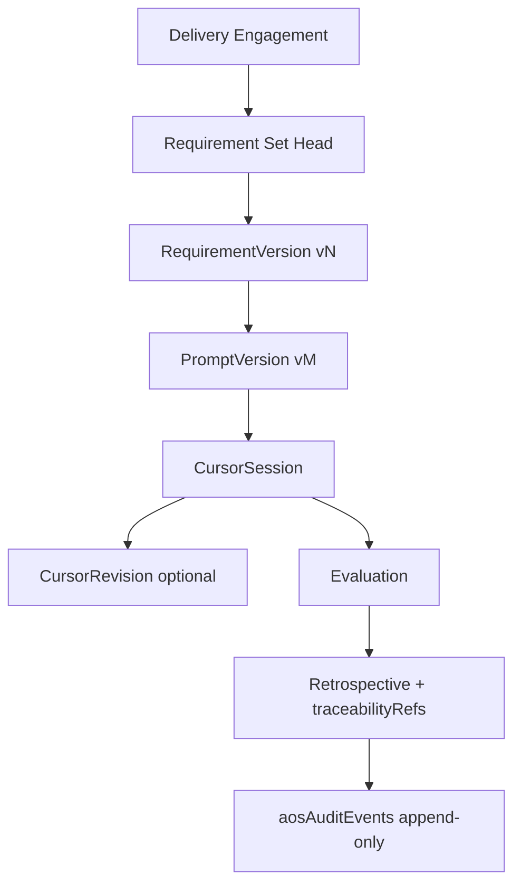

# Phase E — Final Implementation Report

**Status:** CLOSED  
**Date:** 2026-07-21  
**Sprints:** E1 (domain/contracts) · E2 (persistence/security/migration) · E3 (UI/traceability/verification)

---

## 1. Executive Summary

Phase E delivers **immutable version chains** for AOS delivery engagements: Requirement → Prompt → Cursor Session → Evaluation → Retrospective traceability, with Firestore-backed persistence, security rules, lazy D4 migration, application orchestration, and founder-facing history UI on existing Engagement Hub screens (ST-05/07/08/09/11).

All regression commands pass. Emulator-backed lineage, migration idempotency, and immutability matrices are green.

**Verdict: Phase E CLOSED — GO for next phase (Learning Engine promotion pipeline only; not started).**

---

## 2. E1 Summary

- Domain modules: `RequirementVersion`, `PromptVersion`, `CursorSession`, `CursorRevision`, `Evaluation`
- Repository contracts defined; workflow aggregate refactored to head + pointers
- `versionRegistry` retained as **non-authoritative** in-memory fallback when version chains disabled
- Domain unit tests for V-01…V-15 invariants

---

## 3. E2 Summary

- Five dedicated Firestore collections (`aosRequirementVersions`, `aosPromptVersions`, `aosCursorSessions`, `aosCursorRevisions`, `aosEvaluations`)
- Transactional publish orchestrator with `VERSION_CONFLICT` concurrency protection
- Lazy D4 migration (requirement + prompt) with `aos_version_migration_materialized` audit
- Security rules + indexes; `AOS_VERSION_CHAINS_ENABLED` feature flag (default true)
- Application history list APIs; no UI

---

## 4. E3 Summary

- Reusable history UI: `VersionHistoryPanel`, `VersionHistoryList`, `VersionDetailView`, `TraceabilityReference`
- TanStack Query hooks for scoped immutable history (5 min staleTime, no realtime listeners)
- Enhanced Requirements, Prompts, Cursor, Evaluation, Retrospective screens (no ST redesign)
- Retrospective `traceabilityRefs` captured at approve time
- Integration: legacy prompt migration, cursor revision lineage, full lineage through retrospective reload
- Accessibility: axe coverage on `VersionHistoryPanel`

---

## 5. Screens Modified

| Screen | Path |
|--------|------|
| Requirements (ST-05) | `aos/presentation/screens/engagement-hub/requirements/EngagementRequirementsScreen.tsx` |
| Prompts (ST-07) | `aos/presentation/screens/engagement-hub/prompts/EngagementPromptsScreen.tsx` |
| Cursor (ST-08) | `aos/presentation/screens/engagement-hub/cursor/EngagementCursorScreen.tsx` |
| Evaluation (ST-09) | `aos/presentation/screens/engagement-hub/evaluation/EngagementEvaluationScreen.tsx` |
| Retrospective (ST-11) | `aos/presentation/screens/engagement-hub/retrospective/EngagementRetrospectiveScreen.tsx` |

Supporting detail components: `aos/presentation/screens/engagement-hub/components/*`

---

## 6. Components Created/Reused

**Created (E3):**

- `VersionHistoryPanel`, `VersionHistoryList`, `VersionDetailView`, `TraceabilityReference`
- `versionHistoryFormat.ts` (founder-friendly labels)
- Detail content: `RequirementVersionDetailContent`, `PromptVersionDetailContent`, `CursorSessionDetailContent`, `EvaluationDetailContent`

**Reused (Sprint 1 catalog):**

- `DataTable`, `Card`, `SidePanel`, `StatusChip`/`LifecycleBadge`, `LoadingState`, `EmptyState`, `ErrorState`, `Timeline`, `EvaluationCard`, `CursorSessionCard`, etc.

---

## 7. Requirement History UX

- Current approved badge with version number and approval timestamp
- `VersionHistoryPanel` lists immutable v1…vN; current marked with chip
- Side panel read-only detail: snapshot items, supersedes link, version ID (copyable)
- Draft editing unchanged on mutable head only
- Legacy/disabled flag: compatibility message, no fabricated history

---

## 8. Prompt History UX

- Per-artifact version history with requirement version binding
- Navigable requirement reference (SidePanel) without new routes
- Read-only prompt body in historical detail

---

## 9. Cursor History/Revision UX

- Session history with prompt version lineage
- Finalized sessions read-only; capture controls only on non-finalized live sessions
- Revision lineage displayed when `aosCursorRevisions` records exist for session

---

## 10. Evaluation History UX

- Lineage refs: session, prompt, requirement, rubric (founder labels + copyable IDs)
- Evaluation history panel with read-only confirmed/overridden detail
- `amendsEvaluationId` shown as amendment relationship, not replacement

---

## 11. Retrospective Traceability

- Domain: `DeliveryTraceabilityRefs` on `Retrospective` entity
- Populated at `approveRetrospective` via `buildDeliveryTraceabilityRefs`
- Audit event includes artifact metadata on retro approve
- UI section "Delivery traceability" — prep for Learning Engine; **no promotion executed**

---

## 12. Complete Immutable Lineage Diagram

---

## 13. Application Query Architecture

- `EngagementWorkflowApplicationService`: list + detail getters for all version entities
- Hooks: `useVersionHistoryQueries.ts` with stable keys under `aosQueryKeys.versionHistory.*`
- Presentation uses `useAosServices().workflow` only — **no Firestore, no repositories, no domain imports in screens**
- Scoped queries: engagement + set/artifact/session; immutable staleTime 5 minutes

---

## 14. Security/Permission Behavior

- History visibility inherits existing area permissions (`REQUIREMENTS_*`, `PROMPTS_*`, `CURSOR_*`, etc.)
- Firestore rules enforce tenant isolation + immutability (emulator-tested)
- No new permission keys invented

---

## 15. Feature Flag Compatibility

- `AOS_FEATURE_FLAG.VERSION_CHAINS` / `isVersionChainsEnabled()` (default **true**)
- When **enabled**: dedicated collections authoritative; history UI active
- When **disabled**: workflow DTO shows `versionChainsEnabled: false`; history panels show compatibility messaging; embedded head fields remain readable
- `versionRegistry` not persisted when chains enabled

---

## 16. Legacy Requirement Migration Runtime Result

**PASS** — emulator test `materializes legacy approved requirements idempotently`  
- v1 materialized, pointer set, audit event, repeat → count remains 1, embedded data preserved

---

## 17. Legacy Prompt Migration Runtime Result

**PASS** — emulator test `materializes legacy approved prompt pack idempotently`  
- v1 prompt bound to exact requirement version, audit event, idempotent, embedded body not deleted

---

## 18. Cursor Revision Integration Result

**PASS** — emulator test `preserves cursor revision lineage for failed session`  
- Domain rule: revision requires **failed** session (ADR-006); open → resolved with `revisionPromptVersionId`; reload preserves lineage  
- Security: cross-company read denied; delete denied on revisions

---

## 19. Full Lineage Emulator Test Result

**PASS** — `persists full immutable lineage through retrospective reload`  
- Req → Prompt → Session → Eval → Retro refs persisted; reload verifies exact IDs; requirement detail snapshot intact

---

## 20. Immutability Runtime Matrix

| Entity | Update | Delete | Emulator |
|--------|--------|--------|----------|
| RequirementVersion | DENIED | DENIED | PASS |
| PromptVersion | DENIED | DENIED | PASS |
| Finalized CursorSession | DENIED | DENIED | PASS |
| CursorRevision (resolved) | DENIED* | DENIED | PASS |
| Confirmed Evaluation | DENIED | DENIED | PASS |
| AuditEvent | DENIED | DENIED | PASS |

\*Open revision allows resolve-only update per rules.

---

## 21. Cross-Company Runtime Matrix

| Collection | Foreign read | Foreign write |
|------------|--------------|---------------|
| RequirementVersion | DENIED | DENIED |
| CursorRevision | DENIED | — |
| Workflow / Audit | DENIED | DENIED |

All tested in `firestoreSecurity.integration.test.ts`.

---

## 22. Accessibility Verification

- `VersionHistoryPanel.test.tsx`: axe-core scan — **0 violations**
- SidePanel: focus trap, escape key, `role="dialog"`, `aria-modal`
- History list: semantic table (desktop) + keyboard-activatable cards (mobile)
- Read-only state communicated via text label, not color alone

---

## 23. Responsive Verification

- Desktop: `DataTable` + `SidePanel`
- Mobile: card list (`md:hidden` / `hidden md:block` pattern per design system)
- No horizontal table hacks

---

## 24. Performance Observations

- History loaded per engagement/artifact/session — no global scans
- No Firestore realtime listeners on immutable history
- `staleTime: 5 minutes` on version history queries
- Detail queries fetched only when panel opens (enabled flag on version ID)

---

## 25. Exact Test Counts

| Suite | Count |
|-------|-------|
| `npm run test:aos` (unit/domain/application/UI) | **93** |
| `npm run test:aos:integration` (emulator) | **45** |
| `aos:validate` converter checks | **12** |

E3 additions: +2 UI tests (VersionHistoryPanel), +4 integration tests (prompt migration, revision, full lineage, security revision).

---

## 26. Full Regression Command Results

| Command | Result |
|---------|--------|
| `npm run build` | **PASS** |
| `npm run test:aos` | **PASS — 93/93** |
| `npm run aos:validate` | **PASS — 12 checks** |
| `npm run aos:import-boundaries` | **PASS** |
| `npm run aos:security` | **PASS — 13 collections** |
| `npm run test:aos:integration` | **PASS — 45/45** (Firebase emulators, JDK 21) |

---

## 27. ADR-004 Compliance

- Requirement versions immutable after publish — domain + emulator **PASS**
- Monotonic version numbers — deterministic IDs + transaction **PASS**
- Prompt references requirement version — domain + integration **PASS**

---

## 28. ADR-005 Compliance

- Prompt versions immutable — emulator **PASS**
- Pack replan/domain supersession — domain unit **PASS**

---

## 29. ADR-006 Compliance

- Cursor session append-only / finalized immutability — **PASS**
- Exact `promptVersionId` on session — integration **PASS**
- Revision chain on **failed** session — domain + integration **PASS**

---

## 30. ADR-007 Compliance

- Evaluation immutable after confirm — emulator **PASS**
- Rubric snapshot persisted — converter + integration **PASS**
- Amendment via `amendsEvaluationId` — domain rule (no overwrite)

---

## 31. ADR-013 Compliance

- Mutable head on `aosEngagementWorkflows`; immutable published records in dedicated collections — **PASS**
- `versionRegistry` not production authoritative when chains enabled — **PASS**

---

## 32. ADR-014 Compliance

- Version publish audit events (`aos_requirement_version_published`, etc.) — **PASS**
- Migration audit (`aos_version_migration_materialized`) — **PASS**
- Audit append-only — security **PASS**

---

## 33. V-01 through V-15 Final Matrix

| ID | Status | Evidence |
|----|--------|----------|
| V-01 Immutable published versions | PASS | Domain + emulator |
| V-02 Monotonic versioning | PASS | Concurrency test |
| V-03 Draft-only head edit | PASS | Domain |
| V-04 Publish creates snapshot | PASS | Integration |
| V-05 Supersession links | PASS | DTO + detail UI |
| V-06 Prompt → Requirement ref | PASS | Integration |
| V-07 Session → Prompt ref | PASS | Integration |
| V-08 Eval confirm immutable | PASS | Security |
| V-09 Eval amendment record | PASS | Domain |
| V-10 Tenant isolation | PASS | Security |
| V-11 Lazy migration | PASS | Req + Prompt tests |
| V-12 Audit on publish | PASS | Orchestrator |
| V-13 Feature flag rollback | PASS | UI fallback |
| V-14 History UI read-only | PASS | UI + axe |
| V-15 Retrospective traceability refs | PASS | Domain + lineage test |

---

## 34. Remaining Technical Debt

- `versionRegistry` in-memory fallback when flag disabled (intentional rollback)
- Cursor revision **orchestration** not wired to founder workflow UI (domain + infra complete; revision path is failed-session only)
- Evaluation scoring remains stub (AI engine out of Phase E scope)
- Embedded D4 fields retained on workflow doc (dual projection)
- Prompt pack re-approve on already-approved legacy pack not idempotent at application command level (migration service handles materialization)

---

## 35. Remaining Deferred Phase 2 Items

- Learning Engine promotion execution
- Knowledge record creation / intelligence graph
- Cursor SDK live automation
- Version diff UI
- Realtime Firestore listeners for history
- Removing embedded D4 compatibility fields

---

## 36. Production Readiness Impact

Phase E makes delivery engagements **audit-grade** for immutable delivery artifacts. Founders can inspect version history and lineage in-product. Security and tenant isolation are runtime-proven. Safe rollback via `AOS_VERSION_CHAINS_ENABLED=false`.

---

## 37. Final Architecture Audit

| Layer | Verdict |
|-------|---------|
| Domain | Invariants domain-owned; no UI |
| Application | Orchestration + query mapping only |
| Infrastructure | Dedicated collections authoritative; converters preserve snapshots |
| Presentation | Hooks/services only; no Firestore/repos/domain |
| Traceability | Full chain reconstructable after reload |
| Migration | Idempotent req + prompt |
| Security | Emulator proof complete |

**No Critical/High Phase E architecture violations remain.**

---

## 38. Phase E GO / NO-GO Closure Verdict

## **GO — Phase E CLOSED**

All E1/E2/E3 deliverables complete. Full regression green. Emulator lineage, migration, and immutability proven.

---

## 39. Recommended Next Phase — NAME ONLY

**Learning Engine — Promotion Pipeline (Phase F)**

*(Not started. Do not implement in this closure.)*
