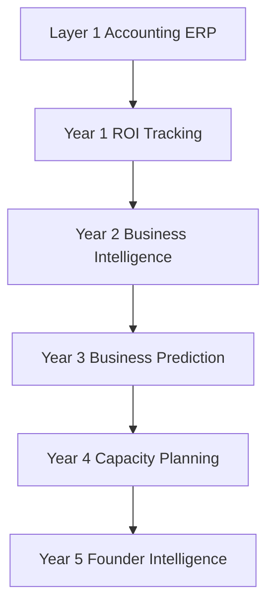

# 05 — Founder Intelligence Roadmap

**Purpose:** Realistic 5-year roadmap showing how each intelligence layer grows from historical business data—without implementing AI, prediction engines, or new modules in this sprint.

**Anchor question:** *How does continuous use of this system make Year 5 founders smarter than Year 1 founders?*

---

## Roadmap Overview

```
Year 1 ──► ROI Tracking        "Did this bet pay back?"
Year 2 ──► Business Intelligence "What patterns repeat?"
Year 3 ──► Business Prediction  "What will likely happen?"
Year 4 ──► Capacity Planning    "Can we absorb this?"
Year 5 ──► Founder Intelligence "What should I do Monday?"
```

Each stage **requires** the data habits of the prior stage.

---

## Year 1 — ROI Tracking

### Objective

Make **initiative-level ROI** trustworthy: investment visible, revenue linkable, decisions recorded, closes produce lessons.

### Data habits (collect daily/weekly)

- Create ventures and initiatives with hypothesis
- Attribute **every strategic expense**
- Attribute **invoices** to initiatives (Phase 1B)
- Record decisions with expected outcomes
- Close initiatives with outcome + lesson
- Zero unattributed spend weekly

### Product capabilities (conceptual)

| Capability | Depends on |
|------------|------------|
| Investment summary | Expense attribution ✅ |
| Revenue summary | Invoice attribution |
| Budget utilization | Budget + investment |
| Initiative ROI (gross) | Investment + revenue |
| Decision history | BosDecision ✅ |
| Unattributed money queue | ERP read + BOS |

### Founder outcome

*"I know what we spent, what we earned, and whether this bet worked—without spreadsheets."*

### Success metric

≥80% strategic spend attributed; ≥20 closed initiatives with lessons in portfolio.

### Natural precursor to Year 2

Clean ROI time series + labeled outcomes = fuel for pattern detection.

---

## Year 2 — Business Intelligence

### Objective

Answer **cross-initiative and cross-channel questions** without manual analysis.

### New data dimensions

- Lead + campaign attribution
- Channel on spend and leads
- Funnel stage events (meeting, proposal, close)
- Decision evaluation (expected vs actual)
- `successCriteria` on all active initiatives
- Venture `businessModelId` classification

### Product capabilities (conceptual)

| Capability | Insight |
|------------|---------|
| Channel comparison | Best CAC source |
| Funnel drop-off | Primary bottleneck |
| Initiative scoreboard | Rank by ROI, burn, decision debt |
| Portfolio allocation | Spend mix vs plan |
| Decision quality report | Which choices worked |
| Similar initiative search | Lessons from past bets |

### Founder outcome

*"I see patterns—I know Meta beats LinkedIn for this venture, and proposals are our bottleneck."*

### Success metric

Founder uses BI weekly instead of exporting to Excel.

### Natural precursor to Year 3

30+ labeled initiatives with funnel + ROI → statistical priors exist.

---

## Year 3 — Business Prediction

### Objective

Move from **backward-looking** to **forward-looking probabilities**—still founder-owned judgment, not black-box AI.

### Historical data used

| Signal | Prediction example |
|--------|-------------------|
| Investment + days active | P(budget exhausted by date X) |
| Funnel rates by channel | P(client) given spend level |
| Past initiative ROI distribution | Expected ROI range for new bet |
| Decision calibration history | Weight founder recommendations |
| Seasonality | Q4 conversion uplift |

### Product capabilities (conceptual)

| Capability | Output |
|------------|--------|
| Initiative priors | "Similar bets returned 40–120% ROI" |
| Kill/scale thresholds | "85% of kills at this signal were correct" |
| Budget forecast | "Runway 6 weeks at current burn" |
| Channel simulator | "+$2k Meta → ~4 leads (90% CI)" |
| Verdict layer | Scale / optimize / pause / kill with confidence |

### Founder outcome

*"Before I commit $10k, I know the base rate and my downside."*

### Success metric

Predictions calibrated within acceptable error; founder trusts confidence bands.

### Natural precursor to Year 4

Prediction exposes **capacity** as binding constraint—not just marketing ROI.

---

## Year 4 — Capacity Planning

### Objective

Connect **ROI to people and delivery**—can the organization absorb growth?

### Additional data

- Team size over time
- Active initiatives per owner
- Delivery duration + complexity
- Project margin by type
- Hire dates and roles
- Backlog / WIP

### Product capabilities (conceptual)

| Capability | Question answered |
|------------|-------------------|
| Initiative capacity model | Can we start another bet? |
| Hire ROI model | Will this hire unlock initiative X? |
| Delivery risk | P(on-time) given load |
| Owner workload | Who is overloaded? |
| Scale gate | "Scale ads only if delivery capacity > Y" |

### Founder outcome

*"I won't scale acquisition until fulfillment can handle it."*

### Success metric

Reduced initiative overload; hiring tied to initiative milestones.

### Natural precursor to Year 5

Judgment + ROI + capacity → **prescriptive founder briefing**.

---

## Year 5 — Founder Intelligence

### Objective

**Monday morning intelligence:** what needs judgment, with full context from 4 years of compounding data.

### Synthesizes

- ROI tracking (Year 1)
- BI patterns (Year 2)
- Probabilities (Year 3)
- Capacity (Year 4)
- Decision memory (all years)

### Product capabilities (conceptual)

| Capability | Experience |
|------------|------------|
| Command Center briefing | 3 attention items with stakes |
| Verdict + confidence | Plain language recommendations |
| Counterfactual memory | "Last time you scaled here…" |
| Portfolio rebalancing | Capital shift suggestions |
| Cross-venture transfer | "Agency lesson applies to SaaS bet" |
| Decision inbox + evaluation | Compounding judgment score |

### Founder outcome

*"The system knows my business history better than any spreadsheet—and tells me what deserves my attention."*

### Success metric

Daily BOS habit; founder cites system in board decisions.

---

## Layer Dependencies



**Break any link → upper layers collapse.**

---

## What NOT to Build Early

| Temptation | Why wait |
|------------|----------|
| AI copilot | No labels yet |
| Prediction dashboard | No history yet |
| 50 KPIs | Derive later |
| Auto-attribution ML | Rules + queue first |
| Cross-company benchmarks | Need own portfolio first |

---

## Current Position (Post Vertical Slice)

| Year 1 item | Status |
|-------------|--------|
| Venture / initiative / decision | ✅ |
| Expense attribution | ✅ |
| Investment summary | ✅ |
| Close + lesson | ✅ |
| Invoice attribution | ❌ Phase 1B |
| Revenue ROI | ❌ |
| Decision evaluation | ❌ |
| Command Center | ❌ Product sprint |
| Channel / funnel | ❌ Phase 2 |

**Verdict:** Foundation for Year 1 ROI is **proven**. Year 1 **not complete** until revenue attribution + decision evaluation + attribution discipline.

---

## 10-Year Portfolio Vision

| Year 6–10 | Capability |
|-----------|------------|
| Multi-venture benchmarks | Your own base rates across businesses |
| Playbooks | "Agency acquisition playbook" from frozen initiatives |
| M&A diligence | Export ROI history for ventures |
| Successor CEO handoff | Institutional memory in BOS |
| Probability on new industries | Weaker priors, still better than zero |

---

## Final Principle Check

Every roadmap stage passes:

> *"If I use this system continuously for 10 years across multiple businesses, will this data significantly improve ROI analysis, BI, predictions, and founder decisions?"*

| Stage | Answer |
|-------|--------|
| Year 1 ROI | **Yes** — foundation |
| Year 2 BI | **Yes** — requires Year 1 discipline |
| Year 3 Prediction | **Yes** — requires labels + volume |
| Year 4 Capacity | **Yes** — requires delivery data |
| Year 5 Founder Intelligence | **Yes** — synthesis of all above |

**Do not skip Year 1 data discipline** to build Year 3 visuals.

---

## Document Index

| Doc | Contents |
|-----|----------|
| `01_Data_Strategy.md` | Field justification, form review, owner review |
| `02_ROI_Architecture.md` | ROI by scope and time |
| `03_Prediction_Data_Model.md` | Historical data for probability |
| `04_Data_Lifecycle.md` | Immutability, versioning, archive |
| `05_Founder_Intelligence_Roadmap.md` | This document |

**Architecture remains frozen.** Next implementation should close **Year 1 ROI gaps**—not prediction modules.
