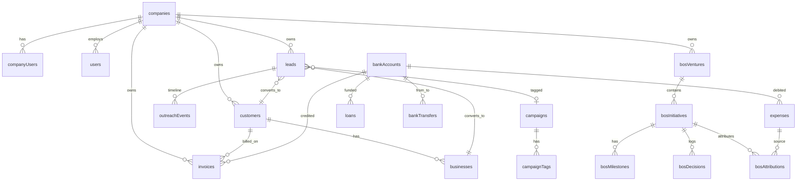

# 03 — Data Flow

How data moves across the ERP, entity relationships, and cross-module dependencies. All flows verified against service and page source code.

---

## Core Business Flow

```
Lead (CRM)
  │
  ├─ outreachEvents (calls, emails, WhatsApp)
  ├─ campaigns / campaignTags (attribution)
  │
  ├─[Won + convertWonLead()]──→ Customer
  │                                │
  │                                ├─ businesses (1:N)
  │                                │
  │                                └─ Invoice(s)
  │                                     │
  │                                     ├─ products (line items)
  │                                     ├─ bankAccounts (payment credit)
  │                                     └─ companies.invoiceCounter
  │
  └─[linked, not converted]──→ Customer (linkedCustomerId only)

Expense ──→ bankAccounts (debit)
  │
  └─ expenseReturns (refund/credit)

Loan ──→ bankAccounts (debit on disburse)
  │
  └─ loanRepayments ──→ bankAccounts (credit)

Bank Transfer ──→ bankAccounts (debit source, credit destination)
Bank Deposit ──→ bankAccounts (credit)
Bank Reconciliation ──→ snapshot (append-only)

Reports ← reads all finance collections (client-side aggregation)
Dashboard ← reads invoices, customers, expenses, leads, bankAccounts
Activity ← logs mutations from all modules
```

---

## Lead → Customer Conversion

**Primary path:** `LeadService.convertWonLead()` in `services/leadService.ts`

1. Validates lead status is **Won**
2. Validates not already converted (`convertedCustomerId` is null)
3. Creates **Customer** document via `CustomerService`
4. Optionally creates **Business** under customer via `BusinessService`
5. Updates lead with `convertedCustomerId`, `convertedBusinessId`
6. Logs activity via `ActivityLogger`

**Evidence fields on lead:**
- `linkedCustomerId` — soft link without conversion
- `convertedCustomerId` — permanent conversion marker
- `convertedBusinessId` — business created during conversion

**UI entry points:**
- `LeadDetailPage.tsx` — convert won lead action
- `CustomerDetailPage.tsx` — displays linked/converted lead relationships

---

## Customer → Invoice Flow

**Primary path:** `InvoiceService` in `services/invoiceService.ts`

1. User selects customer on `InvoiceFormPage.tsx`
2. Line items pulled from `products` catalog (personal or company)
3. Invoice saved to `invoices` collection with `companyId`, `customerId`, `createdById`
4. Company invoice counter incremented on `companies` doc
5. PDF generated via `InvoicePDF.tsx` / `PDFDownloadWrapper.tsx`
6. Payment tracking updates invoice status
7. **Mark paid** debits/credits `bankAccounts` balance

**Create from lead shortcut:**
- `InvoiceFormPage.tsx` accepts `location.state` with pre-filled customer from lead conversion

---

## Expense → Bank Account Flow

**Primary path:** `ExpensesPage.tsx` + `expenseReturnService.ts`

1. Expense created with category, vendor (payee), amount, currency
2. Source `bankAccountId` debited (balance reduced)
3. Optional **expected return** flag enables refund recording
4. `expenseReturns` collection records refunds (append-only, credits bank)
5. Company vs personal scope determined by `utils/expenseCompanyScope.ts`

**Reporting:**
- `ReportsPage.tsx` aggregates expenses, returns, net totals
- Multi-currency USD conversion via `utils/exchangeRates.ts`

---

## Finance Integrity Flow

**Balance integrity check:** `services/balanceIntegrityService.ts`

```
Expected balance = opening + deposits + invoice payments + loan repayments
                   - expenses - loan disbursements - transfers out + transfers in
                   - reconciliations adjustments
```

Invoked from `ReportsPage.tsx` integrity tab. Reads across `bankAccounts`, `expenses`, `invoices`, `loans`, `bankTransfers`, `bankDeposits`, `bankReconciliations`.

---

## CRM Assignment Flow

```
Lead created/imported
  │
  ├─ assignedUserId set (manual or bulk)
  │
  ├─ assignmentEvents subcollection (history)
  │
  ├─ assigneeAssignmentLog (daily audit for dashboards)
  │
  └─ outreachEvents (agent activity timeline)
       │
       └─ PerformancePage / Dashboard call activity widgets
```

**Services:** `leadService.ts`, `assigneeAssignmentLogService.ts`, `outreachService.ts`

---

## Lead Import Flow

**Path:** `LeadImportPage.tsx` → `services/leadImportService.ts`

1. User uploads CSV
2. Column mapping (auto-guess via `autoGuessMapping()`)
3. Row validation (`validateRow()`)
4. Dedupe by phone/email (`applyDedupe()`)
5. Batched Firestore writes to `leads`
6. Error report CSV export (`buildErrorReportCsv()`)

---

## Authentication & Permission Flow

```
SignUpPage
  → Firebase Auth createUser
  → users/{uid} doc (isOwner: true, companyId: uid)
  → companyUsers/{uid} entry

LoginPage
  → Firebase Auth signIn
  → useAuth validates active status
  → TokenService creates session (userTokens)
  → PermissionService.hydrateUserAccess()
  → granularPermissions[] on userProfile

Page access
  → usePermissions.hasPageAccess(pageKey)
  → Sidebar filters nav items
  → ProtectedComponent gates UI elements
  → Page-level redirects for unauthorized access

Real-time refresh
  → RealTimePermissionService listens companyUsers + customRoles
  → Permission changes propagate without re-login
```

---

## Activity Logging Flow

**Service:** `services/activityLogger.ts`

Every major mutation across modules calls `ActivityLogger.log()` writing to `activities` collection:

- Invoice create/edit/delete/paid
- Customer CRUD
- Lead create/assign/convert
- Expense create/edit/delete
- Bank account operations
- User management actions
- Login/logout events

**Consumers:**
- `ActivityPage.tsx` — personal log (filtered by user)
- `CompanyActivityPage.tsx` — company-wide log (admin)

---

## BOS Integration Flow (ERP → BOS)

```
ERP Expense (expenses collection)
  │
  ├─[read via ErpExpenseReadPort]──→ BosAttributionApplicationService
  │                                     │
  │                                     └─ bosAttributions (sidecar write)
  │                                          │
  │                                          └─ Initiative investment summary
  │
ERP Invoice (invoices collection)
  │
  └─[read via ErpInvoiceReadPort]──→ initiativeMilestoneEngine (ROI calc)
       (only when invoice attribution exists in sidecar)

BOS never writes ERP collections (sidecar law)
ERP pages never import BOS modules
```

**Key constraint:** Attribution writes go to `bosAttributions` only. ERP expense document is never modified by BOS.

---

## Data Management (Backup) Flow

**Service:** `services/databaseMigrationService.ts`

```
Export: 29 ERP collections → JSON v5 format
Import: batched writes with validation
History: companies/{companyId}/backups subcollection

NOT included: bosVentures, bosInitiatives, bosDecisions,
               bosAttributions, bosMilestones, bosMilestoneTemplates
```

---

## Entity Relationship Diagram



---

## Tenant Scoping Model

All business data is scoped by `companyId`:

- **Owner signup:** `companyId === owner UID` (self-referential)
- **Team members:** `companyId` copied from owner on invite
- **Resolution:** `services/companyId.ts` → `resolveCompanyIdForUser()`
- **BOS scope:** `hooks/useBosScope.ts` uses same companyId resolution
- **Firestore rules:** `canAccessCompanyData(resource.data.companyId)`

Legacy dual-scope on some collections (`expenses`, `loans`, `bankAccounts`): documents may have both `userId` (personal) and `companyId` (company-wide). Rules use `expenseDataReadOk()` / `loanDataReadOk()` helpers.

---

## Real-Time Data Patterns

| Pattern | Where | Mechanism |
|---------|-------|-----------|
| User profile | Auth | `onSnapshot` on `users/{uid}` |
| Permission refresh | All pages | `RealTimePermissionService` listeners |
| Invoice list | InvoicesListPage | Service subscription or query |
| Lead lists | LeadsPage, MyAssignedLeadsPage | Firestore queries + filters |
| Activity feed | ActivityPage | Real-time listener, 100-entry cap |
| BOS initiatives | BosInitiativesPage | Application service → repository query |

---

## Cross-Module Dependency Matrix

| Module | Reads from | Writes to |
|--------|-----------|-----------|
| Dashboard | invoices, customers, expenses, leads, bankAccounts | — |
| Invoices | customers, products, bankAccounts | invoices, bankAccounts, companies |
| Customers | leads, businesses, invoices | customers, businesses |
| Leads | campaigns, customers, users | leads, outreachEvents, customers (on convert) |
| Expenses | vendors, categories, bankAccounts | expenses, bankAccounts, expenseReturns |
| Loans | bankAccounts | loans, loanRepayments, bankAccounts |
| Reports | 9 finance collections | — (read-only) |
| BOS | expenses, invoices (read), initiatives | bos* collections only |
| User Mgmt | users, companyUsers, customRoles | users, companyUsers, customRoles, userTokens |
| Data Mgmt | 29 collections | backup subcollection |
